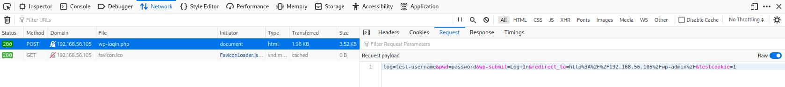
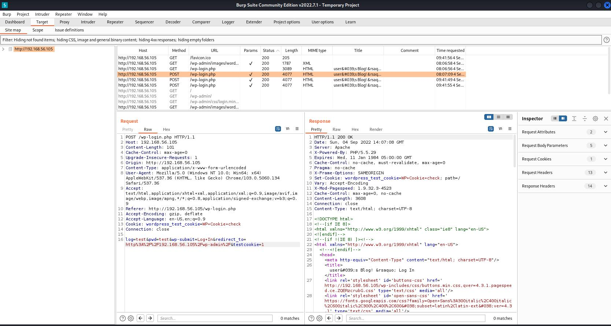

# HTTP / HTTPS

## Ports
- 80 (http)
- 443 (https)

## Commands
- Directory scanners
  - [dirb](#dirb)
  - [nikto](#nikto)
  - [gobuster](#gobuster)
- WordPress scanners
  - [wpscan](#wpscan)
- Brute-force
  - [hydra](#hydra)

## Tools
- [burpsuite](#burpsuite)
- [dirbuster](#dirbuster)

# burpsuite
https://www.kali.org/tools/burpsuite/

Burp Suite is an integrated platform for performing security testing of web applications. Its various tools work seamlessly together to support the entire testing process, from initial mapping and analysis of an application’s attack surface, through to finding and exploiting security vulnerabilities.

Burp gives you full control, letting you combine advanced manual techniques with state-of-the-art automation, to make your work faster, more effective, and more fun.

# dirb
Scan available pages
https://www.hackingarticles.in/comprehensive-guide-on-dirb-tool/

    dirb http://<ip> <opt:wordlist>

options:
- `-z`: Add a milliseconds delay to not cause excessive Flood.

wordlists:
- /usr/share/dirb/wordlist/vulns/...
- /usr/share/dirb/wordlists/big.txt

# Export

    dirb http://<ip>:<port> > /kali-share/dirb-<ip>-<port>.txt

# dirbuster
https://www.kali.org/tools/dirbuster/

DirBuster is a multi threaded java application designed to brute force directories and files names on web/application servers. Often is the case now of what looks like a web server in a state of default installation is actually not, and has pages and applications hidden within. DirBuster attempts to find these.

However tools of this nature are often as only good as the directory and file list they come with. A different approach was taken to generating this. The list was generated from scratch, by crawling the Internet and collecting the directory and files that are actually used by developers! DirBuster comes a total of 9 different lists, this makes DirBuster extremely effective at finding those hidden files and directories. And if that was not enough DirBuster also has the option to perform a pure brute force, which leaves the hidden directories and files nowhere to hide.

# ffuf - Fuzz Faster U Fool

    ffuf -c -w /usr/share/wordlists/rockyou.txt -u http://192.168.56.109/index.php?FUZZ=/etc/passwd
    ffuf -c -v -w ./usernames.txt -X POST -d "username=FUZZ&password=test" -u http://192.168.56.112:8080/ -fr "Invalid username" -H "Content-Type: application/x-www-form-urlencoded"

- `-fs 138` filter out all response of size 138 (useful to remove the "normal" responses)
- `-c` colorize output

> Can be paused by pressing ENTER

# gobuster

https://github.com/OJ/gobuster

## Usage

Command

    gobuster dir -k -r -u http://192.168.56.108/site/ -w /usr/share/seclists/Discovery/Web-Content/common.txt -x txt,php,htmmode (dns, dir, vhost, )
- `-r` follow redirects
- `-u` URL
- `-w` wordlist
- `-x` file extension(s) to search for

Example

    ┌──(kali㉿kali)-[~]
    └─$ gobuster dir -r -u http://192.168.56.108/site/ -w /usr/share/seclists/Discovery/Web-Content/common.txt -x txt,php,html
    ===============================================================
    Gobuster v3.1.0
    by OJ Reeves (@TheColonial) & Christian Mehlmauer (@firefart)
    ===============================================================
    [+] Url:                     http://192.168.56.108/site/
    [+] Method:                  GET
    [+] Threads:                 10
    [+] Wordlist:                /usr/share/seclists/Discovery/Web-Content/common.txt
    [+] Negative Status codes:   404
    [+] User Agent:              gobuster/3.1.0
    [+] Extensions:              php,html,txt
    [+] Follow Redirect:         true
    [+] Timeout:                 10s
    ===============================================================
    2022/09/20 09:39:46 Starting gobuster in directory enumeration mode
    ===============================================================
    /.hta.php             (Status: 403) [Size: 279]
    /.htaccess            (Status: 403) [Size: 279]
    /.htaccess.txt        (Status: 403) [Size: 279]
    /.hta.html            (Status: 403) [Size: 279]
    /.htpasswd.html       (Status: 403) [Size: 279]
    /.htaccess.php        (Status: 403) [Size: 279]
    /.hta                 (Status: 403) [Size: 279]
    /.htaccess.html       (Status: 403) [Size: 279]
    /.htpasswd            (Status: 403) [Size: 279]
    /.hta.txt             (Status: 403) [Size: 279]
    /.htpasswd.txt        (Status: 403) [Size: 279]
    /.htpasswd.php        (Status: 403) [Size: 279]
    /css                  (Status: 200) [Size: 1376]
    /index.html           (Status: 200) [Size: 4419]
    /index.html           (Status: 200) [Size: 4419]
    /images               (Status: 200) [Size: 1360]
    /js                   (Status: 200) [Size: 951]
    /war.txt              (Status: 200) [Size: 13]
                                                    
    ===============================================================
    2022/09/20 09:39:53 Finished
    ===============================================================

# hydra

a very fast network logon cracker which support many different services

## Brute force - HTTP-FORM-POST
> **HINT**  
> Brute force HTTP-FORM-POST can also be achieved with burpsuite but the free version has limitations

Use burpsuite or the browser to get the request payload

    hydra -l <username> -P <pwd-list> <ip|dns> http-form-post "<login-page>:<post-content>:Invalid username"

Example:

    hydra -l Elliot -P /kali-share/downloads/fsocity.dic 192.168.56.105 http-form-post "/wp-login.php:log=^USER^&pwd=^PASS^&wp-submit=Log+In&redirect_to=http%3A%2F%2F192.168.56.105%2Fwp-admin%2F&testcookie=1:Invalid username"
    hydra -l terra -P /usr/share/wordlists/rockyou.txt earth.local https-form-post "/admin/login:csrfmiddlewaretoken=jKg3K2jLIrOih13TfJM1rOmnWdrOWfjbqlxpy7QWQtDbS7raUoMOJ5mT4PlIDZki&username=^USER^&password=^PASS^:Please enter a correct username and password" -I
    hydra -L /usr/share/wordlists/rockyou.txt -p test 192.168.56.112 -s 8080 http-form-post "/:username=^USER^&password=^PASS^:Invalid username"

Options:
- `-l` username
- `-L` username list
- `-p` password
- `-P` password list

# nikto
Gives vulnerabilities

    nikto -h http://<ip>:<port>

## Export

    nikto -h http://<ip>:<port> -o '/kali-share/nikto-<ip>-<port>.xml' -Format xml

Check if you find the following

- phpinfo
- system requirements
- software (i.e. twiki)

# wfuzz

> WARNING consume many resources

    wfuzz -c -z file,/usr/share/wordlists/rockyou.txt -d "username=FUZZ&password=test" --ss "Invalid password" http://192.168.56.112:8080/

## Troubleshoot: Openssl

> Warning:Pycurl is not compiled against Openssl. Wfuzz might not work correctly when fuzzing SSL sites. Check Wfuzz's documentation for more information.

    sudo apt --purge remove python3-pycurl
    sudo apt install libcurl4-openssl-dev libssl-dev
    sudo pip3 install pycurl wfuzz patator
    sudo apt install kali-linux-default kali-linux-headless

# wpscan
Vulnerabilities in WordPress can be uncovered by the WPScan utility, which comes installed by default in Kali Linux. It’s also a great tool for gathering general reconnaissance information about a website that’s running WordPress.

    wpscan --url http://example.com --api-token TOKEN --detection-mode aggressive

> **HINT**  
> Create a free profile on https://wpscan.com/ to get an API token  
> Daily API request limit: 75    
> Vulnerabilities are not shown if you don't use an API token
