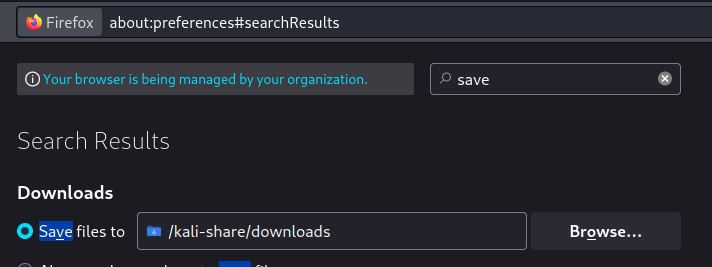
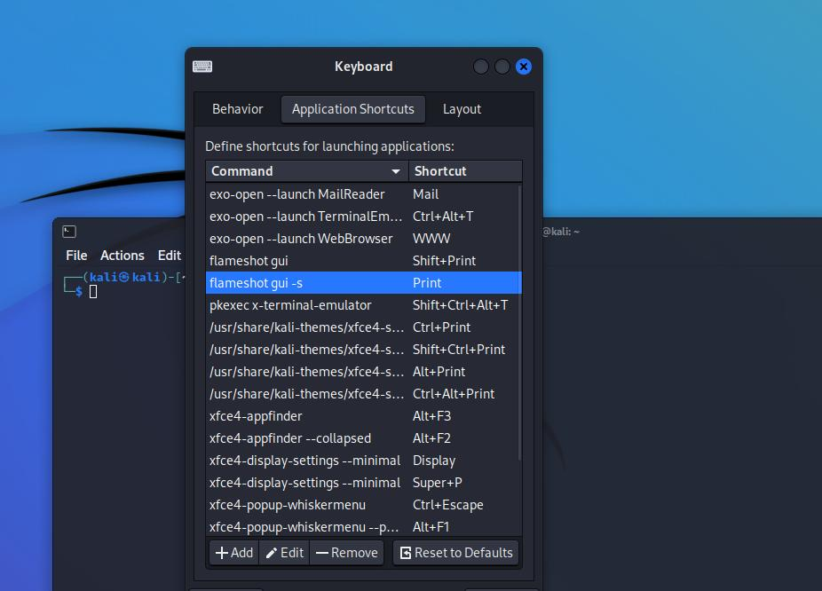

# Kali setup
## Virtual box network
https://www.virtualbox.org/manual/ch06.html

| **Mode**   | **VM→Host** | **VM←Host**                                                                                                                | **VM1↔VM2** | **VM→Net/LAN** | **VM←Net/LAN**                                                                                                             |
| ---------- | ----------- | -------------------------------------------------------------------------------------------------------------------------- | ----------- | -------------- | -------------------------------------------------------------------------------------------------------------------------- |
| Host-only  | **+**       | **+**                                                                                                                      | **+**       | –              | –                                                                                                                          |
| Internal   | –           | –                                                                                                                          | **+**       | –              | –                                                                                                                          |
| Bridged    | **+**       | **+**                                                                                                                      | **+**       | **+**          | **+**                                                                                                                      |
| NAT        | **+**       | [Port forward](https://www.virtualbox.org/manual/ch06.html#natforward "6.3.1. Configuring Port Forwarding with NAT")       | –           | **+**          | [Port forward](https://www.virtualbox.org/manual/ch06.html#natforward "6.3.1. Configuring Port Forwarding with NAT")       |
| NATservice | **+**       | [Port forward](https://www.virtualbox.org/manual/ch06.html#network_nat_service "6.4. Network Address Translation Service") | **+**       | **+**          | [Port forward](https://www.virtualbox.org/manual/ch06.html#network_nat_service "6.4. Network Address Translation Service") |

Note: Restart after setting port forwarding

## Share with host machine
In virtual box

- Select the kali machine
- Click on "Configuration"
- Tab "Shared folders"
- Add "Permanent folder"

Folder path: C:\sci-ospt\kali-share  
Folder name: kali-share  
Read-only: false  
Mount automatically: true  
Mount point: /kali-share  
Permanent configuration: true

## Firefox

### Download folder

### FoxyProxy
Firefox plugin  
https://addons.mozilla.org/en-US/firefox/addon/foxyproxy-standard/

### Cookie Manager
Firefox plugin  
Used to reuse fetched auth / session cookies  
https://addons.mozilla.org/fr/firefox/addon/a-cookie-manager/

## nvm (Node Version Manager)

https://github.com/nvm-sh/nvm#install--update-script

    curl -o- https://raw.githubusercontent.com/nvm-sh/nvm/v0.39.1/install.sh | bash
    export NVM_DIR="$([ -z "${XDG_CONFIG_HOME-}" ] && printf %s "${HOME}/.nvm" || printf %s "${XDG_CONFIG_HOME}/nvm")"
    [ -s "$NVM_DIR/nvm.sh" ] && \. "$NVM_DIR/nvm.sh" # This loads nvm
    
    nvm install 18

## Docker

### Install
https://www.kali.org/docs/containers/installing-docker-on-kali/

To install Docker on Kali you need to remember that there is already a package named “docker”, therefore Docker has to be installed under a different name. If you install docker you will not end up with the container version. The version we will be installing is named docker.io. All commands are the same however, so running docker on the command line will be the appropriate command.

## Dradis CE
Allows to store information.  
Unfortunately, there's no way to export nodes but a copy paste do the job

### Install
**DO NOT USE** kali documentation: https://www.kali.org/tools/dradis/

Use the official installation documentation instead:  
https://dradisframework.com/ce/documentation/ruby.html (I'm using ruby 3.1.2)  
https://dradisframework.com/ce/documentation/install_kali.html  
https://dradisframework.com/ce/documentation/install_git.html

### Getting started
HINT: This will use a standalone terminal

    cd ~/dradis-ce
    ./bin/rails server

Ouput:

    ┌──(kali㉿kali)-[~/dradis-ce]
    └─$ ./bin/rails server
    NOTE: nokogumbo: Using Nokogiri::HTML5 provided by Nokogiri. See
    https://github.com/sparklemotion/nokogiri/issues/2205 for more information.
    => Booting Puma
    => Rails 6.1.6.1 application starting in development 
    => Run `bin/rails server --help` for more startup options
    Puma starting in single mode...
    * Puma version: 5.6.4 (ruby 3.1.2-p20) ("Birdie's Version")
    * Min threads: 5
    * Max threads: 5
    * Environment: development
    *         PID: 313302
    * Listening on http://127.0.0.1:3000
    * Listening on http://[::1]:3000
    * Use Ctrl-C to stop

#### Access address
See `Listening on` when starting dradis  
Above the address is `http://127.0.0.1:3000`

### Alias
You can put an alias to do it easier, i.e. 'dradis'  
First check if the alias exists

    type dradis

Add your alias to ~/.zshrc

    alias dradis='cd ~/dradis-ce && ./bin/rails server'

Restart your shell, you can now start dradis

    ┌──(kali㉿kali)-[~]
    └─$ dradis
    NOTE: nokogumbo: Using Nokogiri::HTML5 provided by Nokogiri. See https://github.com/sparklemotion/nokogiri/issues/2205 for more information.
    => Booting Puma
    => Rails 6.1.6.1 application starting in development
    => Run `bin/rails server --help` for more startup options
    Puma starting in single mode...
    * Puma version: 5.6.4 (ruby 3.1.2-p20) ("Birdie's Version")
    *  Min threads: 5
    *  Max threads: 5
    *  Environment: development
    *          PID: 43197
    * Listening on http://127.0.0.1:3000
    * Listening on http://[::1]:3000
      Use Ctrl-C to stop

### Import data

- Click on the "Upload" tab
- Choose a tool
- Choose a file
- Read "Output console" to check result is ok
#### Importable files
- nmap -`Dradis::Plugins::Nmap`, see [nmap / export](./tools/tools.md#nikto)
- nikto -`Dradis::Plugins::Nikto`, see [nikto / export](./tools/tools.md#nikto)
- metasploit-framework - `Dradis::Plugins::Metasploit`, see [metasploit
  framework / export database](./tools/tools.md#Export database)

### Reset
https://dradisframework.com/ce/documentation/reset.html
#### Instance reset

    cd ~/dradis-ce/
    bundle exec thor dradis:reset

## flameshot (screenshot)
### Install

    apt install flameshot
### Configuration

- Open flameshot from the menu
    - This should open the flameshot trail icon (a flame - top right of the screen)
- Right-click on it and select "Configuration"
- Go to the "General" tab
- Set "Save Path" to `/kali-share/screenshots`
- Check "Use fixed path for screenshots to save
- Preferred save file extension `jpeg`

### Keyboard shortcuts
In kali

- Open the menu
- Type "keyboard"
- Open the "Keyboard" application
- Select the "Application Shortcuts" tab

Shortcut "Print": `flameshot gui -s`  
Shortcut "Shift+Print": `flameshot gui`

